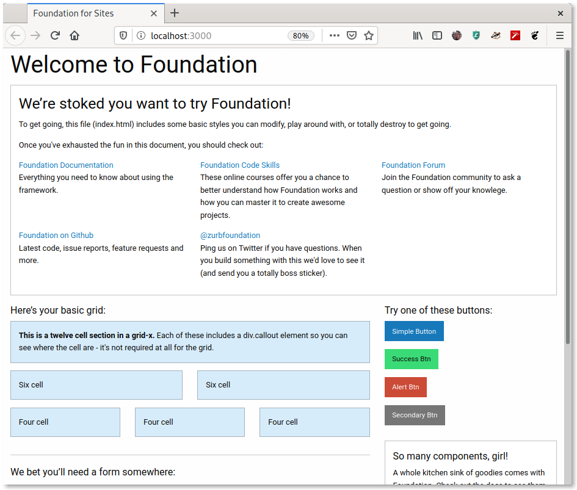

# Basic CRUD with Rocket

This is what I went through while creating my first web app in Rust.

```bash
cargo init kolektilo
```

## Add a route for static files

```rust
use rocket_contrib::serve::StaticFiles;

[ ... ]

fn main() {
    rocket::ignite()
        .attach(Template::fairing())
        .mount("/static", StaticFiles::from(concat!(env!("CARGO_MANIFEST_DIR"), "/static")))
        .mount("/", routes![
            ...
        ])
    .launch();
}
```

This will take any file within the `static` directory and serve it from http://localhost:8000/static

```bash
mkdir static
echo "It works!" > static/hello.txt
cargo run
...
🚀 Rocket has launched from http://localhost:8000
```

Test it with httpie:

```
nnieto@Ziltoid:~$ http GET http://localhost:8000/static/hello.txt
HTTP/1.1 200 OK
Content-Length: 10
Content-Type: text/plain; charset=utf-8
Date: Sat, 18 Jan 2020 06:52:18 GMT
Server: Rocket

It works!
```

## Installing Foundation in `static`

I want to use [Foundation](https://foundation.zurb.com/) for styling. There are a lot of ways to installing it. One way way is to download a customized version of the complete bundle of foundation from it's download page. Another way would be to use a package manager like *npm* or *bower*, a task runner like *grunt* and install a *sass compiler* to create an optimized version of *css* and *js* files. But the easiest way I found is to install the [foundation-cli](https://foundation.zurb.com/) to create all the boilerplate for me.

First step is to make sure you have an updated version of npm

```bash
npm install -g npm
```

Then install/update the foundation-cli package:

```bash
npm install -g foundation-cli
```

Now it's time to generate the boilerplate into the `static`directory.

```bash
foundation new --directory static/
```

Select ***Foundation for sites*** as answer to the first question, and ***Basic template*** for the second question:

```bash
$ foundation new --directory static/
? What are you building today? A website (Foundation for Sites)
? Which template would you like to use? Basic Template: includes a Sass compiler

            .
           /|     ,
      , /|/  \/| /|       Thanks for using ZURB Foundation for Sites!
     /|/       |/ |       -------------------------------------------
 |___|            |___|   Let's set up a new project.
 \___|  ^^   ^^   |___/   It shouldn't take more than a minute.
     | -[O]--[O]- |
     |    ___,    |
     |    ...     |
      \__________/


Downloading the project template...
Done downloading!

Installing dependencies...

[.... Lots of output text here, be patient ...]

You're all set!

 ✓ New project folder created.
 ✓ Node modules installed.
 ✓ Bower components installed.

Now run foundation watch while inside the static folder.
```

Let's run the watch command:

```bash
$ cd static
$ foundation watch

> foundation-sites-template@1.0.0 start /home/nnieto/Code/Hkl/oxxo-kolektilo/static
> gulp

[16:09:20] Using gulpfile ~/Code/Hkl/oxxo-kolektilo/static/gulpfile.js
[16:09:20] Starting 'default'...
[16:09:20] Starting 'sass'...

  Replace Autoprefixer browsers option to Browserslist config.
  Use browserslist key in package.json or .browserslistrc file.

  Using browsers option can cause errors. Browserslist config 
  can be used for Babel, Autoprefixer, postcss-normalize and other tools.

  If you really need to use option, rename it to overrideBrowserslist.

  Learn more at:
  https://github.com/browserslist/browserslist#readme
  https://twitter.com/browserslist


[16:09:21] Finished 'sass' after 1.04 s
[16:09:21] Starting 'serve'...
[Browsersync] Access URLs:
 -------------------------------------
       Local: http://localhost:3000
    External: http://192.168.1.67:3000
 -------------------------------------
          UI: http://localhost:3001
 UI External: http://localhost:3001
 -------------------------------------
[Browsersync] Serving files from: ./
```

Browsersync was installed, so it pops a browser window that shows the *Welcome to foundation* window:



The `foundation watch`  command spins it's own web server on http://localhost:3000, but we are using the web server provided by rocket, so I deleted the `index.html` file, removed the BrowserSync  configuration from `gulpfile.js` and `package.json`. I also re/moved other files to leave the static directory as clean as possible. This is how it looks now:


## Credits

<span>Cover photo by <a href="https://unsplash.com/@spacex?utm_source=unsplash&amp;utm_medium=referral&amp;utm_content=creditCopyText">SpaceX</a> on <a href="https://unsplash.com/s/photos/rocket?utm_source=unsplash&amp;utm_medium=referral&amp;utm_content=creditCopyText">Unsplash</a></span>