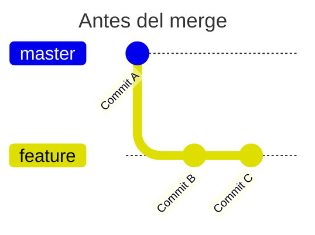
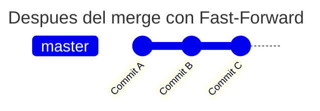
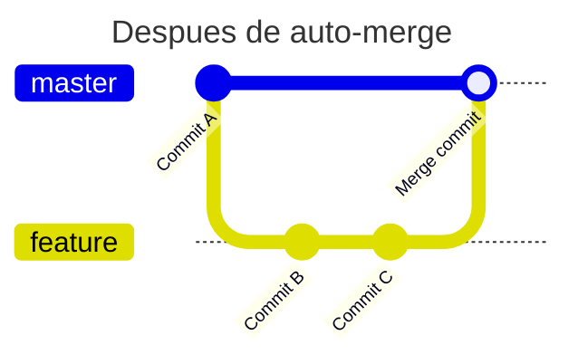

# 🌳 Práctica Parte 2: Trabajando con Múltiples Ramas en Git

## 📋 Pre-requisitos
- Haber completado la Práctica Parte 1
- Tener Git instalado
- Tener el proyecto de calculadora de la práctica anterior

**⏰ Tiempo estimado:** 30-40 minutos
- Parte 1 (Simulando equipo): 15 minutos
- Parte 2 (Visualización): 10 minutos
- Parte 3 (Integración): 10 minutos
- Ejercicio final: 5 minutos

---

## 🎯 Objetivo de esta práctica
En la vida real, los proyectos de software son desarrollados por **equipos**. Mientras tú trabajas en una funcionalidad, tus compañeros trabajan en otras. Hoy vamos a simular ese escenario trabajando con múltiples ramas al mismo tiempo.

**Lo que aprenderás:**
- Trabajar con 2-3 ramas simultáneamente
- Visualizar cómo se ve tu árbol de ramas (y entender esos símbolos raros)
- Entender qué pasa cuando múltiples ramas se fusionan a main
- Prepararte para el trabajo en equipo real

---

## 🎬 Analogía del día: Editando una película

Imagina que están editando una película en equipo:
- **Rama master**: Es la película final que verá el público
- **Rama efectos**: Un editor añade efectos especiales a ciertas escenas
- **Rama audio**: Otro editor mejora el audio y añade música
- **Rama subtitulos**: Un tercer editor añade subtítulos

Todos trabajan **al mismo tiempo** con copias de la película. Al final, todo se integra en la versión final. Algunos cambios se pueden integrar directo (como los subtítulos que no afectan el video), otros necesitan más cuidado (si dos editores tocaron la misma escena). ¡Eso es exactamente lo que haremos con Git!

---

## 🚀 Preparación inicial

### Paso 1: Verificar dónde estamos

Supongamos que tu proyecto esta en `cd C:\Users\TuUsuario\Desktop\mi-calculadora`.

```cmd
cd C:\Users\TuUsuario\Desktop\mi-calculadora
git status
git branch
```

**Deberías ver:**
- Que estás en la rama `master`
- Que tienes las ramas de la práctica anterior

**✅ VERIFICACIÓN**: Si `git status` muestra:
```
On branch master
nothing to commit, working tree clean
```
¡Perfecto! Puedes continuar.

### Paso 2: Limpiar el proyecto (opcional)
Si quieres empezar limpio:
```cmd
git checkout master
git branch -d caracteristica-suma
git branch -d experimento-resta
```

---

## 🔨 Parte 1: Simulando un equipo de desarrollo (15 min)

Vamos a simular que somos 3 programadores diferentes trabajando en la calculadora:
- **Ana**: Añadirá multiplicación
- **Bruno**: Añadirá división
- **Carlos**: Mejorará los mensajes

### 🧑‍💻 Eres Ana: Trabajando en multiplicación

```cmd
git checkout -b feature-multiplicacion
```

Edita `calculadora.py` y añade esta función:
```python
def multiplicar(a, b):
    """Función creada por Ana"""
    return a * b

# Añadir al final del archivo:
print("Multiplicación disponible!")
```

Guarda y haz commit:
```cmd
git add calculadora.py
git commit -m "Ana: Añade función multiplicar"
```

### ✅ Checkpoint 1 - VERIFICACIÓN ESPECÍFICA
Ejecuta este comando:
```cmd
git log --oneline -1
```

**DEBES VER algo como:**
```
abc1234 (HEAD -> feature-multiplicacion) Ana: Añade función multiplicar
```

**Si ves esto, estás bien.** La parte `(HEAD -> feature-multiplicacion)` confirma que estás en la rama correcta y el commit se hizo.

---

### 🧑‍💻 Eres Bruno: Trabajando en división

**IMPORTANTE**: Primero vuelve a master para crear tu rama desde ahí
```cmd
git checkout master
git checkout -b feature-division
```

Edita `calculadora.py` y añade:
```python
def dividir(a, b):
    """Función creada por Bruno"""
    if b != 0:
        return a / b
    else:
        return "Error: No se puede dividir por cero"

# Añadir al final del archivo:
print("División disponible!")
```

Guarda y haz commit:
```cmd
git add calculadora.py
git commit -m "Bruno: Añade función dividir"
```

### ✅ Checkpoint 2 - VERIFICACIÓN ESPECÍFICA
Ejecuta estos comandos:
```cmd
git branch
```

**DEBES VER (el asterisco indica tu rama actual):**
```
  feature-division
* feature-multiplicacion
  master
```

Ahora verifica que cada rama tiene SU propio commit:
```cmd
git log --oneline --all --graph -5
```

**DEBES VER algo como:**
```
* def5678 (HEAD -> feature-division) Bruno: Añade función dividir
| * abc1234 (feature-multiplicacion) Ana: Añade función multiplicar
|/
* xyz9876 (master) Commit inicial
```

**Si ves dos ramas separándose de master, estás perfecto.**

---

### 🧑‍💻 Eres Carlos: Mejorando mensajes

Vuelve a master y crea otra rama:
```cmd
git checkout master
git checkout -b feature-mensajes
```

Edita `calculadora.py` y modifica solo los comentarios:
```python
# CALCULADORA MEJORADA v2.0
# Proyecto del equipo de desarrollo
# Última actualización: [fecha de hoy]

# [El resto del código queda igual]

print("=== CALCULADORA v2.0 ===")
```

Guarda y haz commit:
```cmd
git add calculadora.py
git commit -m "Carlos: Mejora mensajes y documentación"
```

### ✅ Checkpoint 3 - VERIFICACIÓN COMPLETA
```cmd
git log --oneline --all --graph -6
```

**DEBES VER tres ramas partiendo de master:**
```
* ghi7890 (HEAD -> feature-mensajes) Carlos: Mejora mensajes
| * def5678 (feature-division) Bruno: Añade función dividir
|/
| * abc1234 (feature-multiplicacion) Ana: Añade función multiplicar
|/
* xyz9876 (master) Commit inicial
```

**Si ves TRES líneas separándose del mismo punto, ¡EXCELENTE!** Has simulado correctamente 3 desarrolladores.

---

## 📊 Parte 2: Entendiendo git log --graph (10 min)

### 🎓 Explicación paso a paso de los símbolos

Vamos a entender qué significan esos símbolos raros. Empecemos simple:

#### Situación 1: Una sola rama (sin ramificaciones)
```
* Commit 3
* Commit 2
* Commit 1
```
- Cada `*` es un commit
- Van en orden cronológico inverso (el más reciente arriba)

#### Situación 2: Dos ramas separándose
```
* Commit en rama2
| * Commit en rama1
|/
* Commit inicial (donde se separaron)
```
- El `|` es una línea vertical que muestra continuidad
- El `/` muestra donde las ramas se separan o unen
- Cada rama tiene su propia "línea"

#### Situación 3: Después de un merge
```
*   Merge commit (unión de ramas)
|\
| * Commit de la rama que se fusiona
* | Commit de la rama principal
|/
* Commit donde se separaron
```
- El `\` muestra la unión de las ramas
- Un merge commit tiene DOS padres (por eso las dos líneas)

### 📋 LEYENDA VISUAL DE SÍMBOLOS
```
*   = Commit
|   = Continuación de una rama
/   = Rama separándose o uniéndose (hacia la izquierda)
\   = Rama uniéndose (hacia la derecha)
|\  = Un merge (dos ramas convirtiéndose en una)
```

### Veamos TU árbol actual:
```cmd
git log --oneline --graph --all
```

Deberías poder identificar:
- 3 commits en ramas diferentes (los `*`)
- Todas partiendo del mismo punto (donde están los `/`)
- Cada rama en su propia "columna" vertical

---

## 🔄 Parte 3: Integrando todo el trabajo (10 min)

Ahora viene la magia: vamos a integrar TODO el trabajo en master.

### 🎓 Concepto clave: Fast-forward vs Merge commit

Antes de fusionar, entiende qué puede pasar:

#### **Fast-forward merge** (Avance rápido)





```
Antes:
master  →  * Commit A
            ↓
feature →  * Commit B → * Commit C

Después del merge:
master  →  * Commit A → * Commit B → * Commit C
```
- **Cuándo ocurre**: Cuando master NO ha cambiado desde que creaste la rama
- **Qué hace Git**: Simplemente "avanza" master hasta donde está tu rama
- **Resultado**: Historia lineal, sin commit de merge

#### **Merge commit** (Auto-merge o fusión real)

```
Antes:
master  →  * Commit A → * Commit D
            ↓
feature →  * Commit B → * Commit C

Después del merge:
master  →  * Commit A → * Commit D → * Merge commit
            ↓                          ↗
feature →  * Commit B → * Commit C →
```



- **Cuándo ocurre**: Cuando master SÍ ha cambiado (tiene commits nuevos)
- **Qué hace Git**: Crea un NUEVO commit que une ambas historias
- **Resultado**: Se ve la "unión" en el árbol

### Paso 1: Ir a master
```cmd
git checkout master
```

### Paso 2: Fusionar el trabajo de Ana
```cmd
git merge feature-multiplicacion
```

**VERÁS uno de estos mensajes:**

**Opción A - Fast-forward:**
```
Updating xyz9876..abc1234
Fast-forward
 calculadora.py | 5 +++++
 1 file changed, 5 insertions(+)
```

Esto significa que master no había cambiado, así que Git solo "avanzó" master.

### Paso 3: Fusionar el trabajo de Bruno
```cmd
git merge feature-division
```

**Ahora probablemente verás:**
```
Auto-merging calculadora.py
Merge made by the 'ort' strategy.
```
¡Esto es un merge real! Como master YA cambió (con el trabajo de Ana), Git creó un commit de merge.

### Paso 4: Fusionar el trabajo de Carlos
```cmd
git merge feature-mensajes
```

### ✅ Checkpoint 4 - VERIFICACIÓN FINAL
```cmd
git log --oneline -5
```

**DEBES VER varios "Merge branch..." si hubo auto-merges:**
```
abc1234 Merge branch 'feature-mensajes'
def5678 Merge branch 'feature-division'
ghi9012 Ana: Añade función multiplicar
xyz9876 Commit inicial
```

**Para verificar que TODO está integrado:**
```cmd
type calculadora.py
```
Debes ver TODAS las funciones: multiplicar, dividir Y los mensajes mejorados.

---

## 🎨 Visualizando el resultado final

Ejecuta:
```cmd
git log --oneline --graph --all -10
```

Ahora verás algo más complejo. Vamos a decodificarlo juntos:

```
*   Merge branch 'feature-mensajes'     ← Último merge
|\
| * Carlos: Mejora mensajes              ← El trabajo de Carlos
* |   Merge branch 'feature-division'    ← Penúltimo merge
|\ \
| * | Bruno: Añade función dividir       ← El trabajo de Bruno
* | | Ana: Añade función multiplicar     ← El trabajo de Ana (fast-forward)
| |/
|/|
* | Commit inicial                       ← Donde todo empezó
```

**¿Qué estás viendo?**
- Los merges crearon "uniones" en el árbol (los `|\`)
- Cada desarrollador tiene su línea de trabajo
- Todo converge en master
- ¡Esto es un árbol de Git real de trabajo en equipo!

---

## 🔮 Adelanto: ¿Qué son los conflictos?

**Tranquilo, esto es solo para que sepas qué esperar. Lo resolveremos en la Parte 3.**

### ¿Cuándo ocurre un conflicto?
Cuando dos personas modifican LA MISMA línea del MISMO archivo.

### ¿Cómo se ve un conflicto?
Si hubiera ocurrido un conflicto, el archivo se vería así:

```python
def calcular():
<<<<<<< HEAD
    return "Versión de Ana"
=======
    return "Versión de Bruno"
>>>>>>> feature-division
```

**¿Qué significan esos símbolos?**
- `<<<<<<< HEAD`: Inicio del conflicto (tu versión actual)
- `=======`: Separador entre las dos versiones
- `>>>>>>> feature-division`: Fin del conflicto (la versión que intentas fusionar)

**¿Da miedo?** ¡No! En la práctica 3 aprenderás que es solo elegir qué versión quieres (o combinar ambas). Git no puede decidir por ti, así que te pregunta.

---

## 💡 Concepto importante: Git Pull

En un proyecto real, mientras tú trabajas en tu rama, otros desarrolladores están fusionando sus cambios en master. Necesitarías "traer" esos cambios a tu rama.

**Comando que usarías (en el futuro con GitHub):**
```cmd
git pull origin master
```

Por ahora, simularemos esto localmente:

1. Estando en tu rama de feature:
```cmd
git checkout feature-division
```

2. Traer los cambios de master a tu rama:

```cmd
git merge master
```

Esto actualiza tu rama con los últimos cambios de master.

---

## 🔧 Troubleshooting

### "No puedo cambiar de rama"
```cmd
git status
```
Si tienes cambios sin guardar:
```cmd
git add .
git commit -m "Guardando cambios"
```

### "No veo todas las ramas"
```cmd
git branch -a
```

### "Mi merge no funcionó"
```cmd
git merge --abort
```
Esto cancela el merge y vuelve al estado anterior.

### "Quiero ver qué cambió"
```cmd
git diff master feature-multiplicacion
```

### "No entiendo mi árbol de Git"
Simplifica la vista:
```cmd
git log --oneline --graph -10
```
Ver solo 10 commits hace más fácil entender el árbol.

---

## 🏁 Ejercicio Final: Tu turno (5 min)

Crea un mini-proyecto simulando un equipo de 3 personas:

1. **Crea un archivo** `notas.txt` en main con el siguiente contenido:

```
NOTAS DEL PROYECTO
==================
```

A continuacion agrega este archivo al repositorio y hazle *commit*.

```cmd
git add notas.txt
git commit -m "Inicial: Crea archivo de notas"
```

2. **Simula 3 desarrolladores:**

**Developer 1:**
```cmd
git checkout -b dev1-todos
echo. >> notas.txt
echo TODO: >> notas.txt
echo - Tarea 1 >> notas.txt
git add notas.txt
git commit -m "Dev1: Añade sección TODO"
```

**Developer 2:**
```cmd
git checkout master
git checkout -b dev2-completado
echo. >> notas.txt
echo COMPLETADO: >> notas.txt
echo - Tarea 0 >> notas.txt
git add notas.txt
git commit -m "Dev2: Añade sección COMPLETADO"
```

**Developer 3:**
```cmd
git checkout master
git checkout -b dev3-progreso
echo. >> notas.txt
echo EN PROGRESO: >> notas.txt
echo - Tarea actual >> notas.txt
git add notas.txt
git commit -m "Dev3: Añade sección EN PROGRESO"
```

3. **Integración:**
```cmd
git checkout master
git merge dev1-todos
git merge dev2-completado
git merge dev3-progreso
```

4. **Verifica el resultado:**
```cmd
git log --oneline --graph --all -8
type notas.txt
```

### ✅ VERIFICACIÓN FINAL DEL EJERCICIO
Si `type notas.txt` muestra las TRES secciones (TODO, COMPLETADO, EN PROGRESO), ¡lo lograste!

---

## 📊 Resumen de comandos nuevos

| Comando | Qué hace | Cuándo usarlo |
|---------|----------|---------------|
| `git log --graph --all` | Ver árbol de todas las ramas | Para entender la estructura |
| `git log --oneline` | Ver commits resumidos | Para vista rápida |
| `git merge [rama]` | Fusionar rama en la actual | Para integrar trabajo |
| `git diff [rama1] [rama2]` | Ver diferencias entre ramas | Antes de fusionar |
| `echo texto >> archivo` | Añadir texto al final | Para añadir contenido |
| `echo texto > archivo` | Reemplazar todo el archivo | Para crear archivo nuevo |

---

## 🎯 Lo que aprendiste hoy

✅ Trabajar con múltiples ramas simultáneamente
✅ Simular trabajo en equipo
✅ Entender los símbolos del árbol de Git (`*`, `|`, `/`, `\`)
✅ Diferencia entre Fast-forward y Merge commit
✅ Fusionar múltiples ramas en main
✅ Qué aspecto tiene un conflicto (adelanto)
✅ Usar `>` vs `>>` correctamente

---

## 🚀 ¿Qué sigue?

En la **Práctica Parte 3** aprenderás:
- Resolver conflictos de merge (ya sabes cómo se ven, no dan miedo)
- Usar `git stash` para guardar trabajo temporal
- Revertir cambios si algo sale mal
- Prepararte para GitHub

---

## 💭 Reflexión final

Git no es solo una herramienta, es una forma de pensar sobre el desarrollo colaborativo. Cada rama es una escena de la película, cada merge es cuando el director dice "¡Quedó perfecta, la incluimos!", cada commit es un "Guardar" de tu trabajo.

En el mundo real, trabajarás con decenas de desarrolladores, cada uno en su rama, todos contribuyendo al mismo proyecto. Lo que practicaste hoy es exactamente eso, pero en pequeña escala.

**Recuerda:**
- Las ramas son baratas, úsalas libremente
- Haz commits frecuentes con mensajes claros
- Fusiona a menudo para evitar conflictos grandes
- La comunicación con tu equipo es tan importante como el código
- Si no entiendes un símbolo en el árbol, descompónlo parte por parte

---

### 📝 Notas del profesor

Si llegaste hasta aquí, felicitaciones. Ya entiendes cómo funciona el desarrollo colaborativo. Esos símbolos raros del árbol de Git que al principio parecían jeroglíficos, ahora tienen sentido, ¿verdad?

En la industria real, esto es el pan de cada día. Y sí, al principio todos nos confundimos con los símbolos del `git log --graph`. Es normal. Con la práctica, leerás esos árboles como si fueran texto normal.

La próxima vez que uses una aplicación, piensa: decenas de desarrolladores, cientos de ramas, miles de commits, todos trabajando en paralelo para crear lo que usas. Y cuando veas un conflicto en la próxima práctica, recuerda: es solo Git diciéndote "oye, aquí hay dos versiones, ¿cuál prefieres?". Nada más.

¡Nos vemos en la Parte 3! 🚀

---

## 📤 Entrega de la Práctica

Para demostrar que completaste exitosamente esta práctica, debes enviar **2 capturas de pantalla** al canal de WhatsApp del curso:

### Captura 1: El árbol de Git completo
Ejecuta este comando y toma captura:
```cmd
git log --oneline --graph --all
```

**Debe mostrar:**
- Todas las ramas que creaste (feature-multiplicacion, feature-division, feature-mensajes, dev1-todos, dev2-completado, dev3-progreso)
- Los commits de merge
- El árbol con las líneas que muestran las ramificaciones

### Captura 2: El contenido del archivo notas.txt
Ejecuta este comando y toma captura:
```cmd
type notas.txt
```

**Debe mostrar:**
- El encabezado "NOTAS DEL PROYECTO"
- Las tres secciones: TODO, COMPLETADO, EN PROGRESO
- Las tareas de cada sección

### 📸 Cómo tomar las capturas en Windows:
1. **Opción 1:** Presiona `Windows + Shift + S` para usar la herramienta de recorte
2. **Opción 2:** Presiona `Alt + ImprPant` para capturar solo la ventana activa
3. **Opción 3:** Usa la aplicación "Recortes" de Windows

### ✅ Checklist antes de enviar:
- [ ] La captura del árbol muestra TODAS las ramas y merges
- [ ] La captura del archivo muestra las 3 secciones completas
- [ ] Las capturas se ven claras y legibles
- [ ] Incluiste tu nombre en el mensaje de WhatsApp

**Fecha límite de entrega:** [A definir por el profesor]

---

**¡Excelente trabajo!** 🎉 Si completaste esta práctica, ya dominas el trabajo colaborativo con Git. Esto es exactamente lo que usarás en proyectos reales.
