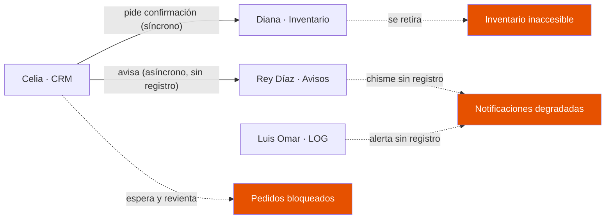
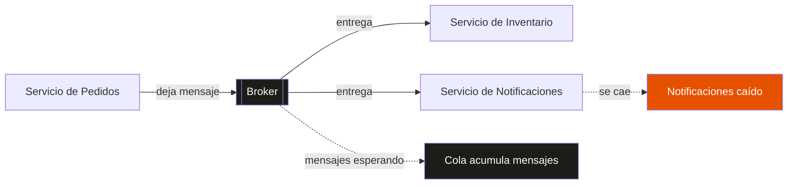

## ¿Por qué se llama Kafka?

Confieso algo: la primera vez que escuché «[Apache Kafka](https://kafka.apache.org/)», mi única referencia era [*La metamorfosis*](https://es.wikipedia.org/wiki/La_metamorfosis) de Franz Kafka. Y la primera emoción que me surgió no fue interés, sino desconcierto: *¿qué? ¿Qué tiene que ver la historia de un hombre que amanece convertido en cucaracha con un proyecto de código abierto?*

El error era mío, y era de ignorancia: no he leído toda la obra de Franz Kafka, solo esa novela corta. Sin el resto del contexto, el chiste se me escapaba por completo.

La historia parece ser así: [Jay Kreps](https://x.com/jaykreps), junto con [Neha Narkhede](https://www.nehanarkhede.com/) y [Jun Rao](https://www.linkedin.com/in/junrao/), crearon Kafka mientras trabajaban en LinkedIn[^kreps-et-al-2011]. A Kreps se le ocurrió el nombre como un juego de palabras técnico y literario[^narkhede-et-al-2017]:

> "I thought that since Kafka was a system optimized for writing, using a writer's name would make sense. I had taken a lot of lit classes in college and liked Franz Kafka. Plus the name sounded cool for an open source project."
>
> — Jay Kreps, citado en *Kafka: The Definitive Guide*, cap. 1[^narkhede-et-al-2017]

Y en español:

> «Pensé que, como Kafka era un sistema optimizado para escribir, usar el nombre de un escritor tendría sentido. Tomé muchas clases de literatura en la universidad y me gustaba Franz Kafka. Además, el nombre sonaba genial para un proyecto de código abierto.»

Para entender el chiste técnico hay que cruzar de la programación y sistemas a la literatura. Kreps ya dio ese salto —por eso eligió nombrarlo así—; a mí me costó más, pero yendo despacio es posible ver lo que él vio.

La raíz del chiste técnico radica en el *write-optimized*: estar **optimizado para escribir**. Kafka está diseñado para guardar y registrar millones de eventos por segundo en un registro de datos (un *commit log*); su punto fuerte es la velocidad para escribir datos masivos en disco, de forma continua. Y escribir aquí tiene un truco: solo se van pegando hojas al final del cuaderno, jamás se corrige una de en medio; y leer no es distinto: abres cualquier página marcada, pero siempre hacia adelante. Por eso es tan rápido. Y aquí va el puente: Franz Kafka, el escritor, era justo eso — un autor obsesivo que escribía de manera compulsiva, de madrugada. Trabajó catorce años en una aseguradora, de ocho a dos de la tarde, y las noches las dedicó a escribir. [La condena](https://es.wikipedia.org/wiki/La_condena) la escribió de un tirón en una sola noche de septiembre de 1912. **El juego de palabras de Kreps une el rendimiento del software, que escribe datos rapidísimo, con la personalidad del autor, que escribía sin parar**.

Pero el puente no termina ahí, y ahí está la ironía: ambos compran velocidad y pagan con legibilidad. Aclaro: esta lectura es mía, no de Kreps. La crítica literaria describe la prosa de Kafka como clara, precisa, sobria —lo laberíntico es la situación, no la sintaxis—; el puente funciona con algo más terroso: textos escritos de madrugada y sin lector en mente, algo parecido a lo que sentirías si leyeras un *commit log* crudo de Apache Kafka. Ambos legibles solo para quien sabe reconstruir el contexto. Y la ironía se invierte sola: el escritor que pidió a Max Brod que quemaran casi todos sus manuscritos —el más *delete-happy* de la literatura— le pone nombre al sistema cuya virtud es que nada de lo escrito se borra (salvo por retención). Kreps no lo eligió por legible; lo eligió por incansable.

Ya cruzamos el puente del nombre. Ahora viene lo serio: el problema que Kafka resuelve no tiene nada de literario — es de los que te despiertan a las tres de la mañana en producción. Propongo una historia.

## El Despacho

El **Despacho Especial Unido Deadlock y Asociados, S.A. de C.V.** es una agencia aduanal en Mexicali, Baja California. En enero abrió una sucursal nueva cerca de la garita Nuevo Mexicali: almacén grande, mostradores, cubículos para unos diez empleados, aunque casi siempre hay cuatro. En los meses templados se trabaja con ventanas abiertas, se platica en la puerta y nadie tiene prisa.

**Diana Báez** *lleva el inventario impecable desde siempre*. Nunca se ha perdido un embarque, con una sola excepción: el verano pasado. Un requisito aduanal se traspapeló y la mercancía del cliente quedó retenida. El detalle es que últimamente a Diana le da más calor de lo normal, y por eso trae su abanico incluso en invierno. El viento del abanico empujó el requisito detrás del escritorio, donde quedó oculto meses. Diana desmontó el escritorio entero, sudando, y lo encontró. Todos lo tomaron como rareza, no como señal.

**Celia R. Montes** *lleva la atención al cliente por teléfono, mostrador y WhatsApp*. Es eficiente cuando se concentra, pero se toma su tiempo mientras presiona a los demás para que todo salga ya.

Entre Celia y Diana no hay un sistema, hay una costumbre. *Nadie escribe un pedido en ninguna parte*: Celia atiende al cliente y, con el cliente todavía esperando, le grita a Diana por encima de los cubículos:

> —¡Diana! ¿Me confirmas si hay veinte del modelo que te dije?

Y Diana, sin levantar la vista, le responde de memoria. Así ha funcionado los treinta años que lleva la agencia. Cuando hay poco trabajo, la costumbre alcanza y sobra. El detalle está en que *cada pedido depende de que Diana, en ese instante exacto, esté de pie y le conteste*. Y Celia, mientras tanto, *sostiene el pedido en la línea*: el teléfono sonando y el cliente mirándola desde la sala de espera.

**Rey Díaz** *es el mensajero y coordinador de embarques.* Organizado, diligente, y con un don: repite los recados al vuelo, tal cual se los cuentan, palabra por palabra… y ya. Rey es chismoso por naturaleza —no puede guardarse una noticia—, y por eso es el canal de comunicación predilecto de todos: se entera de todo y lo cuenta todo, solo que nunca por escrito. Eso si, no le pregunten qué hizo ayer: ¡nunca se acuerda! Ayer, para Rey Díaz, no existe. **No guarda nada: ni de hoy, ni de ayer. Si nadie estaba escuchando en el momento, el mensaje se perdió.** Pero a pesar de todo, el es el más eficiente del Despacho y nadie se preocupa de que sea olvidadizo; nadie anota nada, porque el chisme vuela tan rápido que sobra la libreta.

**Luis Omar García**, «El Chief», *es el de sistemas* y le encanta meterse con todo lo que tenga tornillos y electrónica. Sabe todos los detalles técnicos de la operación del Despacho, pero como todo funciona a la perfección, se dedica a mandar reportes diarios de eficiencia por conducto de Rey Díaz. El reporte es siempre el mismo y todos ya lo conocen; a Rey Díaz le da igual: repetir recados es lo suyo, así que los entrega con gusto. Un día, mientras platicaban, Rey Díaz admitió que si se ganaba la lotería lo primero que haría sería irse de vacaciones, mínimo un año. El Chief le contestó que *sin el chismosote del Despacho se les cae el changarro*. Se rieron mucho.

En febrero llegó el aire acondicionado nuevo. Rey Díaz pasó el recado a todo mundo, como de costumbre, y El Chief salió caminando hacia el almacén con gran emoción para ver el nuevo producto. Pero al abrir la caja, algo le pareció extraño: la marca del empaquetado no era la del aparato. «¡Chale, esto parece un aire pirata!», dijo. Rey Díaz, que pasaba por ahí, entregó el mensaje a todos: «El Chief dice que el aire nuevo es pirata». Nadie supo qué hacer con la información. El Chief se encogió de hombros —en ese momento estaba más interesado en tornillos y electrónica que en garantías y contratos— y lo instaló de todos modos.

La instalación ocurrió con total normalidad y las pruebas del aire acondicionado fueron exitosas. Si enfriaba, significaba que funcionaba. Con el clima templado de la primavera, tampoco hubo manera de comprobar su funcionamiento bajo estrés. El aparato nuevo dormía en el techo, esperando a que alguien lo pusiera a prueba. Un defecto no es nada mientras nadie lo exige.

En Mexicali la ola de calor no se anuncia: llega. Un día la máxima es 36, al siguiente sube a 42 y ya no baja hasta octubre. De un día para otro. A finales de mayo se encendió el aire sin problema; funcionó de maravilla todo junio y julio. Pero en pleno agosto, un día con la máxima en 54 grados, a las tres de la tarde, el aire acondicionado nuevo se apaga.

No truena, no chispea. *Thump.* Se oye cuando el compresor central se para. El ruido sordo de los motores se esfuma. El calor irradia desde las paredes. El Chief sube a la azotea: todo luce bien, nada parece estar estropeado, nunca ha visto un fallo así. Baja derrotado, bañado en sudor y mareado.

Diana es la primera en sufrir los estragos del calor e irse. No puede concentrarse en el inventario, y *un inventario que Diana no puede revisar no vale nada*. No había dormido la noche anterior—aunque era de noche, el termómetro marcaba cuarenta grados—y venía vencida. El calor de Mexicali no deja descansar a nadie en verano, y a ella, que desde hace meses vive con un sofoco que no entiende, la estaba venciendo. Ella había avisado, a su manera, desde enero con el abanico; pero nadie le hizo caso, porque un abanico no parece una alarma. Se levanta, agarra su bolsa y se va a trabajar desde casa. Nadie le dice nada: trae una cara de pocos amigos. Al pasar por la puerta grita, sin que nadie la escuche, que le avisen cuando ya hayan arreglado la refri. Su escritorio queda vacío, el abanico tirado. Paradójicamente, desde casa Diana casi no puede hacer nada: la mercancía real está en la oficina.

Celia todavía tiene trabajo pendiente y necesita la confirmación del stock. Siguiendo la costumbre, le grita a Diana por encima de los cubículos que le confirme si ya tienen el stock para el cliente. **Nadie responde**. Solo puede esperar y desesperarse.

**Sin la confirmación de Diana, Celia no puede procesar ni un pedido**. Los clientes del mostrador se retiran por el sofocante calor de la oficina, pero siguen llegando llamadas y mensajes de WhatsApp, y cada uno es un pedido que no puede cerrar. Se levanta y le grita a El Chief que arregle el aire de una vez por todas, pero El Chief está en el baño, echándose agua en la cabeza —en Mexicali, en verano, el agua de la llave sale ardiente; pero eso es mejor que nada—. Está más mareado que nunca y no puede atender berrinches.

Y entonces entra Rey Díaz. No soporta no saber. Es su naturaleza: él comunica, él es el centro de la oficina, el que media los pleitos. Y aquí le toca lo más difícil: comunicar algo que nadie entiende. No hay un solo hecho verificable —el aire se apagó solo, Diana se fue, El Chief no responde—, y Rey Díaz tiene que contar *algo*. Va de escritorio en escritorio, no mintiendo, sino redondeando: «Tal vez Diana solo fue al baño, su abanico sigue ahí, regresará pronto». «No pasa nada, el Chief ahorita lo arregla». «Todo va a salir bien, no se preocupen». Cada recado es una interpretación urgente, y nadie puede volver a la fuente para verificarla.

Rey Díaz no inventa el rumor; el rumor se **completa** solo. Le dice a Celia: «Diana ya arregló lo suyo y regresa mañana, tranquila». A Diana, por teléfono: «Celia está furiosa, dice que sin ti se van a caer todos los pedidos». Cada mensaje le añade un detalle que ya no viene de un hecho, sino de un hueco que había que llenar: «se fue el aire» → «el AC tronó» → «dicen que explotó» → «dicen que ya se apagó medio Mexicali». Y no hay forma de devolverse.

Y como Rey Díaz monopolizaba la comunicación interna, terminó rodeado de personas —Celia al frente—, cada quien con su duda y su versión ya deformada, todos irritados por el calor y porque nada funciona. Trata de atenderlos a todos, hasta que la cacofonía de voces lo rebasa y hace lo único sensato: cortar llamadas a media frase. Ya no atiende a nadie. Por fortuna, ya daban las cinco: soltó que la oficina se cerraba, que pasaran a la salida, que mañana continuarían. Sin Rey Díaz, la oficina se queda sin noticias. Con Rey Díaz, se queda sin hechos. Es lo mismo.

Al día siguiente, Rey Díaz llegó temprano, como siempre, y abrió. De la víspera no se acordaba de nada —ni de El Chief, ni de Diana, ni del aire—, pero la oficina había que abrirla. Se encienden las luces, se destapa el despachador de agua, se cuelga el letrero. La costumbre no pregunta por las personas; solo sigue.

Ese mismo día El Chief pidió un taxi y se fue al hospital, se sentía sumamente mareado y con el corazón a mil por hora: le dio un golpe de calor. No tenía cabeza para avisarle a nadie y en la confusión alrededor de Rey Díaz, nadie notó que El Chief abordaba el taxi. Nadie supo que estuvo internado, y por eso nadie vino a arreglar el aire en varios días. Rey Díaz preguntó a todo mundo por él; nadie sabía nada.

Diana aguantó como pudo: volvía temprano y se iba en cuanto el calor se ponía insoportable, unas tres horas al día en lugar de las ocho de siempre. Celia siguió contestando teléfono y WhatsApp porque alguien tenía que hacerlo, pero cada ausencia de Diana soltaba a los clientes en fila pidiendo informes, y el ciclo se repetía con Rey Díaz cada vez más abrumado por la gente que exigía explicaciones.

A los pocos días, El Chief reapareció. Aunque sabían de su ausencia, nadie le preguntó qué le había pasado ni por qué no había venido, estaban muy ocupados atendiendo el caos; Rey Díaz, con la memoria que se carga ni se acordaba de la ausencia. Rápidamente pidió la garantía del aire y, dos días después, el aparato funcionaba de nuevo. Diana regresó a su escritorio y todo volvió a la normalidad. Nadie recordaba ya aquella tarde de 54 grados en que la oficina cayó en el caos y El Chief acabó en el hospital. Y más importante: nadie recordaba, ni siquiera El Chief, que el aire era pirata.

## El diagnóstico: síncrono y acoplado

Ahora develo el truco. La agencia es tu arquitectura; cada empleado, un servicio. Y los nombres no son casualidad: cada uno codifica la pieza técnica que representa. Vamos por partes.

**Diana Báez es DB**: una base de datos legacy. Piensa en un Microsoft Access que lleva décadas funcionando: los datos son correctos, es la fuente de verdad, pero no hay réplica, no hay acceso remoto, no hay reemplazo. Su disponibilidad depende de que Diana esté físicamente de pie frente a su escritorio. Cuando se retira, no pierde información: pierde disponibilidad. Su abanico de enero era la señal temprana: la versión humana de esas métricas que se deterioran meses antes del incidente, pero nadie sabía leerlas.

**Celia R. Montes es el CRM**: el sistema de intake multicanal —teléfono, mostrador y WhatsApp—, tres frentes a la vez. Recibe pedidos pero no puede cerrar ninguno hasta consultar a Diana **en vivo**; cada frente es una petición *síncrona*. Cuando Diana se fue, Celia esperó y se desesperó: sin respuesta, no había pedido que cerrar. (El problema no era consultar el inventario —toda consulta es legítima—; era que la única vía para responder exigiera que Diana estuviera de pie en ese instante.)

**Rey Díaz es Redis**: [Redis en modo Pub/Sub](https://redis.io/docs/latest/develop/pubsub/), no Redis en general. Avisos en vivo rapidísimos, pero sin persistencia, sin replay, sin audit log. No hay nada que volatilizar: Pub/Sub no guarda ni un segundo de lo que pasa por él. Y como es tan eficiente, nadie pidió nunca persistencia. Si nadie estaba escuchando, el mensaje se perdió. Es lo que tienes **antes** de Kafka[^redis-streams].

**Luis Omar García es LOG**: la observabilidad y la operación con patas. Ojo con las iniciales: son L.O.G., y no hay que confundir este *log* —el humano de guardia, dashboards, alertas— con el *commit log* del principio, del que el siguiente post hablará a fondo. Piensa en Grafana, Loki, Prometheus, Alertmanager… y alguien on-call. Y es también el humano que hace lo que hoy delegamos en herramientas como Chef o Salt: instalar, actualizar y mantener la infraestructura con sus propias manos —incluidos sus reportes diarios, que nadie lee, enrutados por el canal sin registro de Rey Díaz. Detectó la anomalía del aire pirata, avisó, y su alerta se diluyó por el mismo conducto. Peor: cuando el golpe de calor lo mandó al hospital, el monitoreo siguió pintando alertas en un dashboard que ya nadie miraba —sin heartbeat, sin guardia alterna, sin escalamiento. Segunda falla silenciosa.

El reparto, en una tabla:

| Personaje | Componente | Propiedad clave |
|---|---|---|
| Diana Báez | DB | Pierde disponibilidad, no los datos |
| Celia R. Montes | CRM | Petición síncrona bloqueante |
| Rey Díaz | Redis Pub/Sub | Sin persistencia: *at-most-once* |
| El Chief | LOG | Observabilidad + config manual |

Y el aire acondicionado… ese es el punto.

Si lo miras rápido, parece el fallo típico de un **punto único de fallo** (*single point of failure*): un aparato que se daña y tira todo. Esa sería la conclusión cómoda, y es *falsa*. El aire acondicionado **no tiene nada que ver con la operación de la agencia**: no procesa pedidos, no lleva inventario, no despacha embarques. Es, literalmente, infraestructura ambiental. Y un día se apagó, y la oficina entera se detuvo.

Y fíjate de dónde salió el problema: no de la operación, sino de la infraestructura. Un aparato pirata —caja de una marca, aparato de otra— es exactamente una **dependencia sin verificar**: el paquete que se instala porque «parecía funcionar» y nadie se molestó en auditar. Las cascadas de fallos casi nunca nacen en la lógica del negocio; nacen debajo: una actualización de dependencias, un paquete del sistema, un driver, un certificado. Componentes que nadie considera parte de la operación hasta que fallan —o hasta que se apagan a las tres de la tarde— y tumban todo lo que estaba encima. El aire no lo sacamos de la manga: es el tipo de componente que tumba arquitecturas enteras todos los días en producción.

Ese es el hallazgo que importa: el aire no mató a la agencia; **hizo visible que la agencia no toleraba fallos**. Lo que en realidad se rompió fue la *comunicación acoplada* que llevamos treinta años sin mirar. Cada servicio dependía de que el siguiente estuviera de pie, aunque el mal venía en dos sabores: a Celia el silencio la bloqueaba en vivo; Rey Díaz entregaba sin pedir acuse y, si nadie escuchaba, perdía en silencio. Dos males distintos, mismo origen: nada quedaba asentado. No había buffer, no había cola, no había manera de que un trabajo esperara paciente a que el otro volviera. La dependencia con Diana era síncrona: el emisor se bloquea si el receptor no responde ya.

Por eso la lección no es «compra un mejor aire acondicionado». Es: **el desacoplamiento no impide la caída —a los 54 grados, con el mejor log del mundo, la oficina igual se para—; lo que cambia es lo que significa caerse: de apagón con todo perdido a pausa con los hechos asentados, de la que se reanuda sin reconstruir nada. Y contra el aire, que es dependencia ambiental y no de comunicación, el antídoto no es un broker: es redundancia —otro aire, no un aire mejor—**.

En este diagrama, las flechas punteadas naranjas muestran lo que pasa cuando falta un eslabón: el bloqueo sube por la cadena y contamina todo. La alerta de Luis Omar se diluye por el mismo canal sin registro de Rey Díaz, y cuando el humano de guardia cayó, el monitoreo siguió pintando alertas que nadie miraba. **Un servicio depende de que otro esté disponible en tiempo real.** Eso es acoplamiento síncrono.

Por cierto, la agencia se llama Despacho Especial Unido «Deadlock y Asociados», S.A. de C.V. El SAT la conoce como DEUDA. Yo no podría estar más de acuerdo: lo que la agencia llevaba sin saldar, desde enero, era una deuda de comunicación. Y las deudas, sin que importe cuánto tardes en mirarlas, se cobran.

## La idea: desacoplar con mensajería asíncrona

¿Y si en vez de que el CRM le hable directo a la base de datos, le dejara un mensaje en un buzón?

Así de sencilla es la idea. Cuando un sistema usa **mensajería asíncrona**, el emisor no espera que el receptor esté disponible. Deposita el mensaje en un intermediario —un **broker** o una **cola**—, espera la confirmación de que quedó asentado, y solo entonces sigue con su vida. (Rey Díaz, irónicamente, fallaba justo por lo contrario: entregaba sin confirmación de nada.) El receptor lo procesa cuando pueda.

¿Qué gana el sistema?

- **Resiliencia**: si notificaciones se cae, pedidos sigue funcionando normalmente. Los mensajes se acumulan en la cola y se procesan cuando notificaciones vuelva.
- **Desacoplamiento**: los servicios no necesitan conocerse entre sí. Solo acuerdan el formato del mensaje.
- **Desacoplamiento temporal**: emisor y receptor no tienen que estar vivos al mismo tiempo. Diana lee el pedido cuando vuelva, aunque tardara tres días en volver.
- **Control de picos**: en un Black Friday, los mensajes se acumulan en la cola y se procesan a ritmo controlado, sin que el sistema se desborde. La cacofonía que abrumó a Rey Díaz era exactamente eso: un pico sin dónde hacer fila.

El broker actúa como un separador: del lado izquierdo, el emisor no necesita saber quién recibe. Del lado derecho, el receptor no necesita saber quién envía. Y cuando uno se cae, el otro sigue trabajando. **Eso es desacoplamiento.** Y hay intermediarios que van más allá: en vez de entregar el mensaje a uno solo, lo dejan disponible para todos. El pedido de Celia le servía a Diana para el inventario, a Rey para avisar al cliente y a El Chief para su reporte: cada quien leyendo lo mismo, sin competir por el mensaje y sin enterarse de los otros. Eso se llama *fan-out*: un evento escrito una vez, leído N veces. Hay un matiz aquí que va para el siguiente post: ese «todos leen todo» aplica **entre grupos**; dentro de un mismo grupo, los consumidores se reparten las particiones y cada mensaje lo lee uno solo. Qué es un grupo y por qué existe, ya llegaremos.

Ahora regresa a la tarde de los 54 grados y reimagínala con un registro en medio. El pedido de Celia queda asentado aunque Diana no esté; Diana lo levanta de su escritorio cuando vuelva. La alerta del Chief sobre el aire pirata no se diluye: queda escrita, con fecha y fuente, y cualquiera puede volver a leerla. Y el rumor de Rey Díaz tiene antídoto: ante cada versión, hay un hecho asentado que contrastar. Porque sin registro, ni siquiera el análisis del incidente sobrevive: en la oficina real, nadie recordó que el aire era pirata. Nada de esto exige que tres personas estén de pie en el mismo instante.

Y para las confirmaciones en vivo —¿hay veinte del modelo?—, la respuesta honesta es otra: con los eventos asentados en un log, cada servicio puede mantener su propia copia local del inventario —eventualmente consistente, no una fuente fuerte— y consultarse a sí mismo. Cómo se construye esa copia, y qué hacer cuando la respuesta fuerte no admite «casi», queda para el siguiente post.

Ahora, una cola clásica tiene un detalle importante: cuando un mensaje se procesa, se borra. Se fue. No hay historia. Y eso puede ser un problema si necesitas reprocesar mensajes. También este: en una cola clásica aislada, quien llega primero se come el mensaje (*competing consumers*): la cola reparte entre competidores, no difunde. El fan-out a la antigüita sí existía —exchanges de RabbitMQ, topics de JMS—, pero había que construirlo a mano: routing propio, una cola por suscriptor, y suscriptores dados de alta antes del primer mensaje. Lo que el log da de serie es fan-out persistente, con replay y sin pre-registrar a nadie. La diferencia que importa no es quién puede recibir lo mismo: es que la cola borra al entregar y el log retiene.

Y aquí está el pivote: un buzón entrega una carta y la borra. Lo que el Despacho necesita desde hace treinta años no es un buzón: es un **libro de actas** — el hecho se asienta una vez, queda con fecha, y cada quien lo lee a su ritmo sin estorbar a los demás.

## ¿Entonces qué es Kafka?

Aquí es donde Kafka se separa de las colas tradicionales. **Kafka no es solo una cola: es un log distribuido.** Esa diferencia —buzón contra libro— es la del siguiente post: [Kafka no es una cola: es un registro](/blog/kafka-no-es-una-cola-es-un-registro).

Por ahora, basta con que tengas esta imagen mental: Kafka es un sistema diseñado para manejar **streams de eventos** a gran escala. No nació en LinkedIn para que dos servicios platicaran entre sí: nació porque media docena de sistemas —analytics, búsqueda, recomendaciones— necesitaban leer el mismo chorro de eventos, cada quien a su ritmo. Los productores escriben mensajes, los consumidores leen. Y lo que hace especial a Kafka es que los mensajes **no se borran después de leerse** — se quedan ahí según la retención que configures, por tiempo o por tamaño, desde minutos hasta nunca jamás; hay hasta una compactación que conserva lo último por clave, pero ese término se queda para después. Un registro que crece hacia adelante.

Si quieres adelantarte, la pieza canónica sobre este modelo es [The Log: What Every Software Engineer Should Know About Real-Time Data's Unifying Abstraction](https://www.linkedin.com/blog/engineering/distributed-systems/log-what-every-software-engineer-should-know-about-real-time-datas-unifying), de Jay Kreps. Pero con calma: una cosa a la vez.

Para manejar eso, Kafka introduce dos conceptos que vas a escuchar mucho:

- **Particiones**: cómo divide un topic (un canal de mensajes) en partes paralelas para escalar; cada partición mantiene el orden de sus mensajes, y es la clave del mensaje la que decide a cuál va a parar cada evento —misma clave, misma partición, orden garantizado por clave—. Entre particiones no hay orden que respetar, pero ese es cuento del siguiente post.
- **Offsets**: la cuenta de hasta dónde se ha leído — no por consumidor suelto: por grupo y por partición, y guardada en el propio Kafka, para que si el lector se desploma retome donde se quedó. Y como cada grupo lleva su propio marcador, puedes volver a la página uno y releer todo lo que la retención aún conserve, sin pedirle permiso al registro ni a los demás lectores. Eso es el *replay*.

No los voy a explicar a fondo ahora —para eso están los siguientes posts de la serie. Por ahora solo necesitas saber que existen.

## Coda

Kafka se llama como un escritor cuyos personajes quedaban atrapados en trámites que nadie entendía. Irónico, porque Kafka intenta resolver exactamente ese tipo de problemas: sistemas complejos donde la comunicación entre piezas se vuelve una pesadilla.

Kreps lo eligió por el Kafka incansable, el que escribía sin parar. Que su apellido acabara dando un adjetivo a esas pesadillas burocráticas es un plus no buscado, pero le queda: Kafka existe para que la comunicación entre piezas no se vuelva una pesadilla kafkiana.

Si este post te dejó con ganas de entender qué hace Kafka *de verdad*, no una cola sino algo más interesante, dale al siguiente: [Kafka no es una cola: es un registro](/blog/kafka-no-es-una-cola-es-un-registro).

---

[^kreps-et-al-2011]: Kreps, J., Narkhede, N., & Rao, J. (2011). Kafka: A distributed messaging system for log processing. In Proceedings of the NetDB (pp. 1–7). Association for Computing Machinery. https://www.microsoft.com/en-us/research/wp-content/uploads/2017/09/Kafka.pdf
[^narkhede-et-al-2017]: *Cita de:* Narkhede, Neha; Shapira, Gwen; Palino, Todd (2017). *Kafka: The Definitive Guide*, cap. 1. O'Reilly. ISBN 978-1-4919-3611-5.
[^redis-streams]: Sí: Redis también tiene [Streams](https://redis.io/docs/latest/develop/data-types/streams/) —persistente, con consumer groups y replay—. O sea, medio Kafka escondido en Redis. Pero eso es otra historia; y de esa historia va, justo, esta serie.
