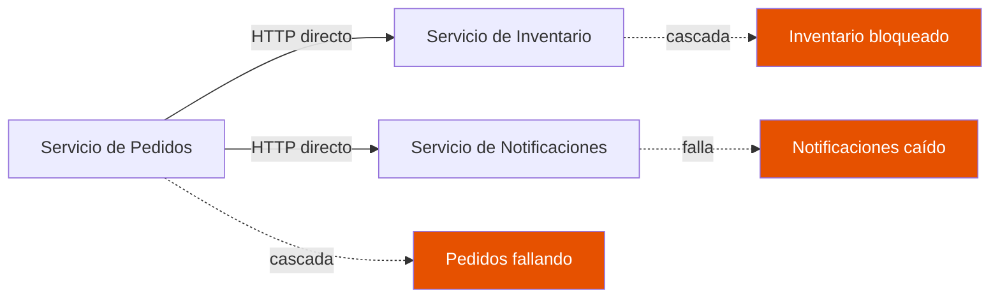
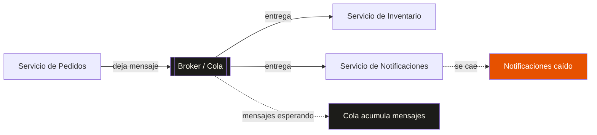

## ¿Por qué se llama Kafka?

Confieso algo: la primera vez que escuché «Kafka», mi única referencia era [*La metamorfosis*](https://es.wikipedia.org/wiki/La_metamorfosis) de Franz Kafka. Y la primera emoción que me surgió no fue interés, sino desconcierto: *¿qué? ¿Qué tiene que ver la historia de un hombre que amanece convertido en cucaracha con un sistema de mensajería?*

El error era mío, y era de ignorancia: no he leído toda la obra de Franz Kafka, solo esa novela. Sin el resto del contexto, el chiste se me escapaba por completo.

La historia parece ser así: [Jay Kreps](https://x.com/jaykreps), uno de los ingenieros que creó Apache Kafka mientras trabajaba en LinkedIn, eligió el nombre como un juego de palabras técnico y literario[^1]:

> "I thought that since Kafka was a system optimized for writing, using a writer's name would make sense. I had taken a lot of lit classes in college and liked Franz Kafka."
>
> — Jay Kreps

Y en español:

> «Pensé que, como Kafka era un sistema optimizado para escribir, usar el nombre de un escritor tendría sentido. Tomé muchas clases de literatura en la universidad y me gustaba Franz Kafka.»

Para entender el chiste técnico hay que cruzar de la programación y sistemas a la literatura. Kreps ya dio ese salto —por eso eligió nombrarlo así—; a mí me costó más pero yendo despacio es posible ver lo que él vio.

La raiz del chiste técnico radica en la **«optimizado para escribir»** (*write-optimized*). Significa que Kafka está diseñado para guardar y registrar millones de eventos por segundo en un registro de datos (un *commit log*): su punto fuerte es la velocidad para escribir datos masivos en disco, de forma continua. Y aquí va el puente: Franz Kafka, el escritor, era justo eso — un autor obsesivo que escribía de manera compulsiva y prolífica, noches enteras. El juego de palabras de Kreps une el rendimiento del software, que escribe datos rapidísimo, con la personalidad del autor, que escribía sin parar.

Pero el puente no termina ahí, y ahí está la ironía: ambos pagan su velocidad a costa de la legibilidad. Los textos de Kafka eran oscuros y laberínticos, difíciles de procesar, igual que un commit log crudo lo es para quien no sabe leerlo. Kreps no eligió a un escritor legible; eligió a un escritor prolífico.

Ya cruzamos el puente del nombre. Ahora viene lo serio: el problema que Kafka resuelve no tiene nada de literario — es de los que te despiertan a las tres de la mañana en producción. Vamos al fondo.

## El problema: cuando un servicio se cae y se lleva a todos

Imagina una tienda en línea. Tienes un servicio de pedidos, un servicio de inventario y un servicio de notificaciones por correo. Todo funciona bien... hasta que el servicio de notificaciones se cae.

¿Qué pasa? El servicio de pedidos, al intentar notificar al usuario, recibe un error. Como no sabe qué hacer con ese error, empieza a fallar también. Luego inventario, porque depende de pedidos para actualizar stock. En cuestión de minutos, toda la cadena se desplomó como un dominó.

Ese es el problema de la **comunicación síncrona y acoplada**: cada servicio depende de que el siguiente esté disponible, respondiendo y con latencia razonable. Funciona bien con tráfico bajo, pero en el momento en que hay un pico o un servicio falla, el efecto cascada es inevitable.

En este diagrama, la flecha punteada naranja muestra lo que pasa cuando C se cae: el error sube por la cadena y contamina todo el sistema. **Un servicio depende de que otro esté disponible en tiempo real.** Eso es acoplamiento síncrono.

## La idea: desacoplar con mensajería asíncrona

¿Y si en vez de que pedidos le hable directo a notificaciones, le dejara un mensaje en un buzón?

Así de sencillo es la idea. Cuando un sistema usa **mensajería asíncrona**, el emisor no espera que el receptor esté disponible. Simplemente deposita el mensaje en un intermediario —un **broker** o una **cola**— y sigue con su vida. El receptor lo procesa cuando pueda.

¿Qué gana el sistema?

- **Resiliencia**: si notificaciones se cae, pedidos sigue funcionando normalmente. Los mensajes se acumulan en la cola y se procesan cuando notificaciones vuelva.
- **Desacoplamiento**: los servicios no necesitan conocerse entre sí. Solo acuerdan el formato del mensaje.
- **Control de picos**: en un Black Friday, los mensajes se acumulan en la cola y se procesan a ritmo controlado, sin que el sistema se desborde.

El broker actúa como un separador: del lado izquierdo, el emisor no necesita saber quién recibe. Del lado derecho, el receptor no necesita saber quién envía. Y cuando uno se cae, el otro sigue trabajando. **Eso es desacoplamiento.**

Ahora, una cola clásica tiene un detalle importante: cuando un mensaje se procesa, se borra. Se fue. No hay historia. Y eso puede ser un problema si necesitas re-procesar mensajes, o si quieres que múltiples consumidores lean los mismos eventos sin que cada uno se los "guarde" de forma distinta.

## ¿Entonces qué es Kafka?

Aquí es donde Kafka se separa de las colas tradicionales. **Kafka no es solo una cola —es un log distribuido.** Pero esa idea central la desarrollo en el siguiente post: [Kafka no es una cola: es un registro](/blog/kafka-no-es-una-cola-es-un-registro/).

Por ahora, basta con que tengas esta imagen mental: Kafka es un sistema diseñado para manejar **streams de eventos** a gran escala. Los productores escriben mensajes, los consumidores leen. Y lo que hace especial a Kafka es que los mensajes no se borran después de leerse —se quedan ahí, como en un registro que crece hacia adelante.

Para manejar eso, Kafka introduce dos conceptos que vas a escuchar mucho:

- **Particiones**: cómo divide un topic (un canal de mensajes) en partes paralelas para escalar.
- **Offsets**: cómo cada consumidor lleva la cuenta de hasta dónde ha leído.

No los voy a explicar a fondo ahora —para eso están los posts B y C de esta serie. Por ahora solo necesitas saber que existen.

## Coda

Kafka se llama como un escritor que escribía burocracias kafkianas. Irónico, porque Kafka intenta resolver exactamente ese tipo de problemas: sistemas complejos donde la comunicación entre piezas se vuelve una pesadilla.

Kreps no solo escribió Kafka: también acertó con el nombre. A los que venimos después nos toca el trabajo menos glamoroso, pero igual de valioso: entender por qué tiene sentido. Hoy cruzamos ese puente juntos; ahora te toca cruzarlo a tu ritmo.

Si este post te dejó con ganas de entender qué hace Kafka *de verdad*, no una cola sino algo más interesante, dale al siguiente: [Kafka no es una cola: es un registro](/blog/kafka-no-es-una-cola-es-un-registro/).

---

[^1]: *Cita de:* Narkhede, Neha; Shapira, Gwen; Palino, Todd (2017). *Kafka: The Definitive Guide*, cap. 1. O'Reilly. ISBN 978-1-4919-3611-5.
