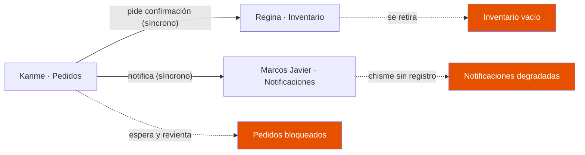
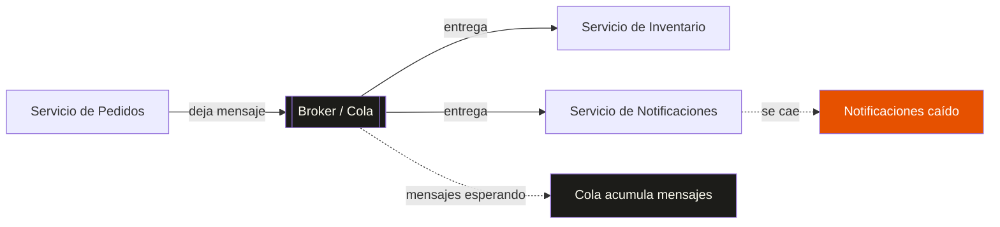

## ¿Por qué se llama Kafka?

Confieso algo: la primera vez que escuché «Kafka», mi única referencia era [*La metamorfosis*](https://es.wikipedia.org/wiki/La_metamorfosis) de Franz Kafka. Y la primera emoción que me surgió no fue interés, sino desconcierto: *¿qué? ¿Qué tiene que ver la historia de un hombre que amanece convertido en cucaracha con un sistema de mensajería?*

El error era mío, y era de ignorancia: no he leído toda la obra de Franz Kafka, solo esa novela. Sin el resto del contexto, el chiste se me escapaba por completo.

La historia parece ser así: [Jay Kreps](https://x.com/jaykreps), uno de los ingenieros que creó Apache Kafka mientras trabajaba en LinkedIn, eligió el nombre como un juego de palabras técnico y literario[^1]:

> "I thought that since Kafka was a system optimized for writing, using a writer's name would make sense. I had taken a lot of lit classes in college and liked Franz Kafka."
>
> — Jay Kreps

Y en español:

> «Pensé que, como Kafka era un sistema optimizado para escribir, usar el nombre de un escritor tendría sentido. Tomé muchas clases de literatura en la universidad y me gustaba Franz Kafka.»

Para entender el chiste técnico hay que cruzar de la programación y sistemas a la literatura. Kreps ya dio ese salto —por eso eligió nombrarlo así—; a mí me costó más pero yendo despacio es posible ver lo que él vio.

La raíz del chiste técnico radica en la **«optimizado para escribir»** (*write-optimized*). Significa que Kafka está diseñado para guardar y registrar millones de eventos por segundo en un registro de datos (un *commit log*): su punto fuerte es la velocidad para escribir datos masivos en disco, de forma continua. Y aquí va el puente: Franz Kafka, el escritor, era justo eso — un autor obsesivo que escribía de manera compulsiva y prolífica, noches enteras. El juego de palabras de Kreps une el rendimiento del software, que escribe datos rapidísimo, con la personalidad del autor, que escribía sin parar.

Pero el puente no termina ahí, y ahí está la ironía: ambos pagan su velocidad a costa de la legibilidad. Los textos de Kafka eran oscuros y laberínticos, difíciles de procesar, igual que un commit log crudo lo es para quien no sabe leerlo. Kreps no eligió a un escritor legible; eligió a un escritor prolífico.

Ya cruzamos el puente del nombre. Ahora viene lo serio: el problema que Kafka resuelve no tiene nada de literario — es de los que te despiertan a las tres de la mañana en producción. Vamos al fondo.

## El Despacho Especial Aduanal Deadlock y Asociados S.A. de C.V.

El Despacho Especial Aduanal Deadlock y Asociados S.A. de C.V. es una agencia aduanal con oficinas centralizadas en Mexicali, Baja California, México. La empresa tiene una trayectoria sólida en los últimos 30 años. Recientemente, en enero, abrieron una nueva sucursal cerca del puerto fronterizo que conecta a Calexico, California: la llamada garita Nuevo Mexicali. El almacén es de reciente construcción y es bastante grande por dentro, y permite la entrada y salida de camiones de transporte de mercancía que entran y salen del almacén las 24 horas del día. Hay espacio de sobra para los automóviles de los empleados. El almacén tiene una oficina relativamente pequeña, pero con espacio suficiente para atender a los clientes, con varios mostradores y una pequeña pero reconfortante sala de espera, con café caliente y galletas de cortesía para la temporada de frío y despachadores de agua helada para el ardiente verano de Mexicali. Detrás de los mostradores, hay cubículos con espacio suficiente para unos 10 empleados, muchos de ellos itinerantes, pero casi siempre hay 4.

Regina Osuna es la encargada del inventario desde que abrió la agencia. Lo lleva impecable, desde siempre. En los años de vida de la empresa nunca se ha perdido un embarque de los clientes —con una sola excepción, el verano pasado.

Un requisito aduanal de un embarque se traspapeló y el embarque quedó retenido por la aduana toda la temporada. El detalle es que últimamente a Regina le da más calor de lo normal, y por eso trae su abanico personal hasta en pleno invierno. El viento del abanico empujó el requisito, que cayó en la parte trasera de su escritorio y quedó ahí oculto por meses. Hasta que, de puro desespero y enfado, Regina desmontó el escritorio entero en busca del comprobante perdido. No permitiría que su carrera terminara manchada de esa forma. Sudando, lo encontró.

Sintió un alivio enorme, y lo mismo sus colegas, que a decir verdad ya estaban preocupados por sus continuos arranques de desesperación. Era algo inusual en ella: Regina nunca se desesperaba, era la más sensata de todo el equipo. Pero ahora solo tiene mucho calor, incluso en pleno invierno.

El invierno mexicalense puede ser frío —las mínimas rondan los 5 °C—, pero el otoño y la primavera son otra cosa: días templados, tanto que la gente se olvida de que vive en el desierto. En esos meses, en el Despacho Deadlock y Asociados se trabaja con las ventanas abiertas, se platica en la puerta y nadie tiene prisa.

Karime Crostwhite lleva la atención al cliente. Es de Sinaloa, viste ropa moderna que la hace ver seria y atractiva a la vez. Trae uñas largas de gelish, maquillaje demasiado claro para su tez morena y siempre está pegada al teléfono. Su energía le da para atender teléfono, mostrador y WhatsApp al mismo tiempo. Es eficiente cuando se concentra, pero entre las uñas y el *doom scroll* de TikTok, Facebook e Instagram su trabajo es más lento de lo que debería. Se lleva bien con todos, pero no ve la contradicción: presiona a los demás para que todo salga ya, mientras ella sí que se toma su tiempo.

Entre Karime y Regina no hay un sistema, hay una costumbre. Nadie escribe un pedido en ninguna parte: Karime atiende al cliente —por teléfono, por el mostrador o por WhatsApp, da igual— y, con el cliente todavía esperando, le grita a Regina por encima de los cubículos:

—¡Ósuna! ¿Me confirmas si hay veinte del modelo que te dije?

Y Regina, sin levantar la vista de su inventario, le responde de memoria. Así ha funcionado los treinta años que lleva la agencia. Cuando hay poco trabajo, la costumbre alcanza y sobra. El detalle está en que cada pedido depende de que Regina, en ese instante exacto, esté de pie y suelte lo suyo para contestarle. Y Karime, mientras tanto, sostiene el pedido en la línea: tres mostradores, el teléfono sonando y el cliente mirándola desde la sala de espera.

Cuando el pedido queda cerrado, Karime se lo pasa a Marcos Javier por el mismo método: le grita de cubículo en cubículo que ya confirme, que ya embarque, que ya avise al cliente. Marcos Javier no anota nada —nunca olvida un recado, ¿para qué?—. Confía en su memoria y en el oído fino. Él es el canal por el que pasan todas las noticias: le encanta, y todos se lo agradecen, porque nadie más se acuerda de avisar al cliente. Lo que nadie se ha puesto a pensar es que, si el origen de una noticia se olvida, no hay manera de volver a escucharla: lo que no quedó escrito, sencillamente no existe.

Marcos Javier es el mensajero y coordinador de embarques, y es el corazón de la oficina. Extremadamente puntual, siempre bien vestido, la barba perfectamente recortada —siempre—, las uñas impecables, los zapatos relucientes; usa los mejores perfumes, de esos que dejan estela, y por eso en el Despacho todo mundo sabe por dónde pasó Marcos Javier. Todos le cuentan sus cosas y él media los pleitos. Es un gran tipo. También es chismoso —no puede guardarse una noticia—, y por eso es el canal perfecto: se entera de todo y lo cuenta todo, solo que nunca por escrito.

Lo que de verdad asombra de Marcos Javier es su memoria. Privilegiada, como si tuviera un archivo en la cabeza: recuerda nombres, fechas, horas y circunstancias de conversaciones que ocurrieron hace años. Tal vez no sea bueno con los números, pero tiene un talento especial para recordar las cosas que importan en un mostrador. Y, lo más valioso de todo: nunca olvida un solo recado. Es, de lejos, uno de los colaboradores más importantes del Despacho y lo es tanto que ya nadie anota nada.

José Rojas, «El Chief», es el de sistemas, pero le encanta meterse con todo lo que tenga tornillos y electrónica. Es su pasión. Habla y se viste como El Vítor —corte de queso, camisa satinada, cadenas—, pero jura que él no tiene ese cantadito chilango. Todos le dan carrilla, en especial Marcos Javier; tanto, que un día, en medio de la carrilla, José se quiso defender entre risas:

—¡Chale, Marcos Javieeer, suéltame que me lastimaaas!... Oye, ya fuera de broma, neta que eres bieeen chismoso, a todo mundo le cuentas todo. No manches, ¿te imaginas que un día te ganas la lotería y te vuelves millonario? ¿Seguirías trabajando?

—Uy, lo primero que haría es irme de vacaciones, mínimo un año —responde Marcos.

—¡No manches, Marcos Javieeer! Imagínate la que se arma si el chismosote del despacho de pronto ya no anda recordándoles a todos lo que tienen que hacer. ¡Neta se nos cae el changarro!

Los dos estallan en carcajadas. En eso, Marcos recibe una llamada: acaba de llegar el nuevo aire acondicionado. Al colgar, le grita a José, que ya caminaba rumbo a su cubículo:

—¡Oye, Chief! ¡Ya llegó el nuevo aire acondicionado! Ven para que lo revises y lo instales.

—¡Abuelita de Batman, Marcos Javieeer! ¡Vamos a ver el nuevo juguete!

Y aunque nadie lo sabe todavía, El Chief tiene una maldición: siempre tiene razón, pero nadie le cree hasta que es demasiado tarde.

A El Chief le olió raro desde el instante en que abrió la caja. Corría febrero, y no sabía qué era; solo sabía que algo no le cuadraba.

—¡Oye, Marcos Javieeer, ven acá! ¡Neta que esto está raro! —grita desde el almacén.

—¿Chief, qué pasa? ¿Por qué me gritas? —Marcos asoma la cabeza, a medias, todavía cotorreando con Karime sobre un cliente—. ¿No ves que estoy en algo?

—«Ira», Marcos Javieeer: la caja del empaquetado es de una marca, pero el aparato es de otra. Esto está requete raro. ¿No nos habrán dado un aire pirata?

—¿Y vienen las piezas completas? —pregunta Marcos, que de aires sabe poco, pero de trámites lo conoce todo—. O lo regresamos.

—No le veo problema. Solo se me hizo raro, todo luce bien. Lo voy a instalar —decide El Chief, encogiéndose de hombros—. Si pasa algo, tenemos garantía con el fabricante.

—Ok. Si quieres, yo le aviso a doña Regina. A lo mejor ella sabe qué se hace en estos casos.

—«Baambi es un venado», mi buen Marcos Javieeer —sentencia El Chief, quitándole importancia con su latiguillo—. Yo me pongo a instalarlo, tú dedícate a investigar.

Y Marcos hizo lo que mejor sabe hacer: entregó el mensaje. Se lo llevó a doña Regina, pero ella estaba tan concentrada atendiendo los pedidos que le gritaba Karime que apenas le puso atención. Eso sí, Marcos se aseguró de que todos supieran del incidente de José, porque su memoria no guarda silencios: lo contó de escritorio en escritorio, con lujo de detalle. Solo que nadie sabía qué hacer con esa información. El incidente pasó desapercibido y nadie le tomó importancia alguna. Total, decían, si el aparato es nuevo, ¿qué podría salir mal?

El aire acondicionado, mientras tanto, hizo exactamente lo que le tocaba. En el frío de febrero casi ni se usó, y con el clima templado de la primavera, con las ventanas abiertas y la puerta de par en par, tampoco hizo falta. Los meses pasaron sin drama: el aparato nuevo dormía tranquilo allá en el techo, esperando a que alguien lo encendiera de verdad, y nadie volvió a acordarse de la marca que no cuadraba. Un defecto no es nada mientras nadie lo exige. Todos estaban confiados en la idea de que un aire acondicionado nuevo no puede fallar.

En Mexicali la ola de calor no se anuncia: llega. Un día la máxima es 38, al otro 39, baja a 37, y al siguiente amanece en 42 y ya no baja hasta octubre. De un día para otro. Como si alguien hubiera decidido que el verano empieza mañana. El Chief siempre se queja así, en su tono chillante característico que niega rotundamente: «Chale, ya le prendieron al horno y ora no lo apagan hasta octubre». Y cuando llega el calor, todo mundo prende el aire día y noche. Si no, te mueres. Así ocurrió en el Despacho: a finales de mayo se encendió el aire acondicionado nuevo, sin problema alguno, y durante junio y julio funcionó de maravilla. Pero en pleno agosto, un día con la máxima pronosticada en 54 grados, a las tres de la tarde, el aire acondicionado nuevo se apaga.

No truena, no chispea, no huele a quemado. Simplemente deja de funcionar. *Thump.* Se oye cuando el compresor central se para. El ruido sordo de 60 hertz de los motores andando se esfuma, y queda el sonido de los compresores de las demás oficinas. Deja de salir aire fresco de las ventilas. Inmediatamente comienza a sentirse el calor que irradia desde las paredes. Nadie sabe por qué dejó de funcionar. El Chief solo grita:

—¡Chale, está bien caliente allá afuera, no manches!

No tiene otra opción más que subir a la azotea a inspeccionar. Lo revisa: está energizado. Se asoma por la orilla y le grita a Marcos:

—¡Marcos Javieeer, enciende el aire!

—¡Listo, Chief! —responde Marcos desde la ventana de la oficina—.

Pero nada pasa. Lo golpea un poco —nada. El Chief baja derrotado del techo, bañado en sudor y mareado por el calor intenso. Para colmo, su soda ya se calentó y no lo refresca. El aparato, que era nuevo, era defectuoso; pero eso no lo sabía nadie, y ya no importa: la oficina se convierte en un horno minuto a minuto, grado por grado.

Regina es la primera en irse. Y es lógico: ese día venía más irritable de lo acostumbrado. No era para menos. El calor de Mexicali no descansa a nadie en verano, y a ella, que desde hace meses vive con un sofoco que no entiende, la estaba venciendo. La noche anterior, incluso con el aire viejo al tope, la mínima no había bajado de cuarenta grados, y Regina no había dormido. Llegó a la oficina ya agotada, con el abanico pegado a la cara y la paciencia gastada. Ella había avisado, a su manera, desde enero con el abanico; pero nadie le hizo caso, porque un abanico no parece una alarma. Y ahora, con el horno de nuevo, ya no puede más. No puede concentrarse en el inventario, y un inventario que Regina no puede revisar no vale nada. Así que se levanta, agarra su bolsa, las llaves del coche, y se va a trabajar desde su casa. Nadie le dice nada: trae una cara de pocos amigos. Al pasar por la puerta, sin detenerse, solo alcanza a soltar:

—Chief, avísame cuando ya hayas arreglado la refri.

José no responde. Está en otra parte. En un tono seco, y algo agresivo, Regina se va. Ese mensaje da a entender que seguirá trabajando desde su casa. Pero todo mundo sabe que las labores terminan a las cinco, que ya son más de las tres, y que con esa cara Regina no regresa hoy. Punto. Y si el aire no llega a tiempo, pueden ser varios días. Y peor: desde su casa, Regina solo puede hacer muy poco, porque la mayoría del trabajo está en la oficina, junto a la mercancía real. Su escritorio, con el abanico tirado y las llaves ausentes, queda vacío.

Karime todavía tiene trabajo pendiente y necesita la confirmación del stock. Siguiendo la costumbre, le grita a Regina por encima de los cubículos:

—¡Regina! ¿Me confirmas si ya tenemos el stock para el cliente?

Nadie responde. Así funcionan aquí: gritas o caminas al escritorio del otro y esperas a que te responda. Pero Regina ya no está. Karime espera. Se desespera. Revienta:

—¡No te pases, Regina, contéstame!

Sin la confirmación de Regina, Karime no puede procesar ni un pedido. Los clientes del mostrador se van retirando por el sofocante calor de la oficina, pero siguen llegando llamadas y mensajes de WhatsApp, y cada uno es un pedido que no puede cerrar. Karime no lo soporta. Se levanta y grita:

—¡Chief! ¡Arregla ese maldito aire acondicionado! ¡Me estoy derritiendo, weee, ya deja de estar jugando!

El Chief no responde. Está en el baño, echándose agua en la cabeza. No es agua fresca: en Mexicali, en verano, el agua del grifo sale ardiente; pero eso es mejor que nada. El Chief está más mareado que nunca y no entiende lo que le está pasando, mucho menos puede atender los berrinches de Karime.

Y entonces entra Marcos Javier.

Marcos Javier no soporta no saber. Es su naturaleza: él comunica, él es el centro de la oficina, el que media los pleitos. Y aquí le toca lo más difícil de su oficio: comunicar algo que nadie entiende. No hay un solo hecho verificable en toda la oficina — el aire se apagó solo, Regina se fue, El Chief no responde —, y Marcos tiene que contar *algo*. Así que va de escritorio en escritorio, no mintiendo, sino redondeando: «Seguro Regina ya viene de regreso». «No pasa nada, el Chief ahorita lo arregla». «Todo va a salir bien, no se preocupen». Y fíjate en lo que pasa cuando el único canal de noticias es un hombre que no deja nada escrito: cada recado es una interpretación urgente, y como nadie puede volver a la fuente para verificar, la interpretación de uno se convierte en el hecho del siguiente. Marcos no inventa el rumor; el rumor lo **completa**. Le dice a Karime: «Regina ya arregló lo suyo y regresa mañana, tranquila». A Regina, por teléfono: «Karime está furiosa, dice que sin ti se van a caer todos los pedidos». Cada mensaje le añade un detalle que ya no viene de un hecho, sino de un hueco que había que llenar: se fue el aire → el AC tronó → dicen que explotó → dicen que ya se apagó medio Mexicali. Y no hay forma de devolverse: lo que no quedó escrito, deja de existir.

Por eso, cuando todo se empieza a torcer, todos corren a preguntarle a Marcos Javier. Es lo único que tienen para saber qué está pasando, y él es el único que quiere dar respuestas. Uno por uno van a su escritorio, cada quien con su duda y su versión ya deformada, y él trata de atenderlos a todos, hasta que ya no atiende a nadie. La fila frente a su escritorio se hace larga y él se ahoga en su propia noticia. No es maldad: es un canal al que le pidieron ser veraz sin darle una sola verdad que no cambie de forma al pasar de boca en boca. Sin Marcos Javier, la oficina se queda sin noticias. Con Marcos Javier, se queda sin hechos. Es lo mismo.

El Chief lo avisó. Aquel día, parado frente a la caja, con lo de la marca que no cuadraba. Pero la advertencia se fue por el mismo conducto de siempre: la boca de Marcos Javier, y ya nadie supo qué hacer con ella, porque El Chief siempre se queja de todo. Nadie lo supo, ni siquiera cuando dejó de importar. Y sobre todo, nadie vio lo que de verdad mató a la oficina: no fue el aire. El aire solo hizo la pregunta. Lo que los tumbó fue lo otro, lo que llevaban treinta años haciendo sin darse cuenta: depender de que el que estaba a la par estuviera de pie y te contestara. La oficina entera era una fila de gente parada frente a escritorios, esperando. Y cuando faltó una, se pararon todos. Karime, de pie frente al escritorio vacío de Regina, el abanico tirado, a las tres de la tarde, esperando una respuesta que no llegó.

A El Chief le dio un golpe de calor. No le avisó a nadie: se levantó de su cubículo, tomó sus llaves y se fue directo al hospital. Nadie en la oficina supo que estuvo internado, y por eso tampoco nadie vino a arreglar el aire. Pasaron dos días sin que nadie supiera de él.

Ese mismo día, Marcos Javier cerró la oficina, porque ya nadie entendía nada —ni siquiera él— y el calor era insoportable. Al día siguiente llegó temprano, como siempre, y abrió, que era lo que siempre hacía. No sabía nada de José, ni de Regina, pero la oficina había que abrirla. Y se abre: se encienden las luces, se destapa el despachador de agua, se cuelga el letrero. La costumbre no pregunta por las personas; solo sigue.

Karime volvió todos los días. No había aire acondicionado, pero los clientes seguían llamando y mandando mensajes por WhatsApp, y alguien tenía que contestarles. Hablaba con Regina por teléfono y hacía lo que podía. A veces Regina no le respondía, y Karime entonces dejaba el pedido para después, o lo arreglaba como se le ocurría, y nadie se daba cuenta de la diferencia.

A los pocos días, El Chief reapareció. Pidió la garantía del aire acondicionado y, dos semanas después, el aparato funcionaba de nuevo. Regina regresó a su escritorio. Todo volvió a la normalidad. Nadie recordaba ya el día de cuarenta grados, ni la fila frente a los cubículos, ni la marca que no cuadraba. Menos que nada, nadie recordaba que el aire era pirata.

## Comunicación síncrona vs acoplada

Ahora develo el truco. La agencia es tu arquitectura; cada empleado, un servicio. Vamos por partes.

**Regina es una base de datos legacy**—el inventario. Es el sistema de registro, la fuente de verdad donde viven los datos reales. Lleva treinta años funcionando igual, sin cambios, y es profundamente confiable... siempre y cuando esté de pie y disponible. Porque todo el mundo depende de ella: sin la confirmación de Regina, no hay pedido que avance.

**Karime es el frontend**—el servicio de pedidos que habla con los clientes. Y fíjate en su naturaleza: atiende por teléfono, por mostrador y por WhatsApp, tres frentes a la vez, y cada frente es una petición *síncrona*: ella no puede cerrar ninguna hasta que Regina le responda. Cuando Regina se fue, Karime no pudo desacoplar su trabajo del de Regina; simplemente esperó, y luego reventó.

**Marcos Javier es el servicio de notificaciones**—el canal por donde pasa el estado del sistema. Y es el fallo más sutil de todos: un canal sin registro. Marcos reparte la información, pero como no deja nada escrito, cada mensaje que pasa por él cambia de forma. No es que mienta; es que un canal sin persistencia *no puede* ser fiel a la fuente. La noticia se degrada en cada salto.

**José, «El Chief», es el operador**—la señal de monitoreo. Y su tragedia es la más kafkiana: detectó la anomalía (la marca que no cuadraba) y avisó, pero como su canal era el mismo chisme de Marcos Javier, su alerta se diluyó. La advertencia existió; simplemente no había un lugar confiable donde dejarla.

Y el aire acondicionado... ese es el punto.

Si lo miras rápido, parece el fallo típico de un **punto único de fallo** (*single point of failure*): un aparato que se daña y tira todo. Esa sería la conclusión cómoda, y es *falsa*. El aire acondicionado **no tiene nada que ver con la operación de la agencia**—no procesa pedidos, no lleva inventario, no despacha embarques. Es, literalmente, infraestructura ambiental. Y un día se apagó, y la oficina entera se detuvo.

Ese es el hallazgo que importa: el aire no mató a la agencia; **hizo visible que la agencia no toleraba fallos**. Lo que en realidad se rompió fue la *comunicación acoplada* que llevamos treinta años sin mirar. Cada servicio dependía de que el siguiente estuviera de pie **y** le contestara **en vivo**. No había buffer, no había cola, no había manera de que un trabajo esperara paciente a que el otro volviera. La dependencia era síncrona: el emisor se bloquea si el receptor no responde ya.

Por eso la lección no es «compra un mejor aire acondicionado». Es: **si tu sistema se cae por completo porque falló una pieza que ni siquiera es parte de la operación, el problema no es esa pieza—es que tu sistema no está desacoplado**.

En este diagrama, las flechas punteadas naranjas muestran lo que pasa cuando falta un eslabón: el bloqueo sube por la cadena y contamina todo. **Un servicio depende de que otro esté disponible en tiempo real.** Eso es acoplamiento síncrono.

Por cierto, la agencia se llama Despacho Especial Aduanal «Deadlock y Asociados», S.A. de C.V. El SAT la conoce como DEUDA. Yo no podría estar más de acuerdo: lo que la agencia llevaba sin saldar, desde enero, era una deuda de comunicación. Y las deudas, sin que importe cuánto tardes en mirarlas, se cobran.

## La idea: desacoplar con mensajería asíncrona

¿Y si en vez de que pedidos le hable directo a notificaciones, le dejara un mensaje en un buzón?

Así de sencillo es la idea. Cuando un sistema usa **mensajería asíncrona**, el emisor no espera que el receptor esté disponible. Simplemente deposita el mensaje en un intermediario —un **broker** o una **cola**— y sigue con su vida. El receptor lo procesa cuando pueda.

¿Qué gana el sistema?

- **Resiliencia**: si notificaciones se cae, pedidos sigue funcionando normalmente. Los mensajes se acumulan en la cola y se procesan cuando notificaciones vuelva.
- **Desacoplamiento**: los servicios no necesitan conocerse entre sí. Solo acuerdan el formato del mensaje.
- **Control de picos**: en un Black Friday, los mensajes se acumulan en la cola y se procesan a ritmo controlado, sin que el sistema se desborde.

El broker actúa como un separador: del lado izquierdo, el emisor no necesita saber quién recibe. Del lado derecho, el receptor no necesita saber quién envía. Y cuando uno se cae, el otro sigue trabajando. **Eso es desacoplamiento.**

Ahora, una cola clásica tiene un detalle importante: cuando un mensaje se procesa, se borra. Se fue. No hay historia. Y eso puede ser un problema si necesitas re-procesar mensajes, o si quieres que múltiples consumidores lean los mismos eventos sin que cada uno se los "guarde" de forma distinta.

## ¿Entonces qué es Kafka?

Aquí es donde Kafka se separa de las colas tradicionales. **Kafka no es solo una cola —es un log distribuido.** Pero esa idea central la desarrollo en el siguiente post: [Kafka no es una cola: es un registro](/blog/kafka-no-es-una-cola-es-un-registro/).

Por ahora, basta con que tengas esta imagen mental: Kafka es un sistema diseñado para manejar **streams de eventos** a gran escala. Los productores escriben mensajes, los consumidores leen. Y lo que hace especial a Kafka es que los mensajes no se borran después de leerse —se quedan ahí, como en un registro que crece hacia adelante.

Para manejar eso, Kafka introduce dos conceptos que vas a escuchar mucho:

- **Particiones**: cómo divide un topic (un canal de mensajes) en partes paralelas para escalar.
- **Offsets**: cómo cada consumidor lleva la cuenta de hasta dónde ha leído.

No los voy a explicar a fondo ahora —para eso están los posts B y C de esta serie. Por ahora solo necesitas saber que existen.

## Coda

Kafka se llama como un escritor que escribía burocracias kafkianas. Irónico, porque Kafka intenta resolver exactamente ese tipo de problemas: sistemas complejos donde la comunicación entre piezas se vuelve una pesadilla.

Kreps no solo escribió Kafka: también acertó con el nombre. A los que venimos después nos toca el trabajo menos glamoroso, pero igual de valioso: entender por qué tiene sentido. Hoy cruzamos ese puente juntos; ahora te toca cruzarlo a tu ritmo.

Si este post te dejó con ganas de entender qué hace Kafka *de verdad*, no una cola sino algo más interesante, dale al siguiente: [Kafka no es una cola: es un registro](/blog/kafka-no-es-una-cola-es-un-registro/).

---

[^1]: *Cita de:* Narkhede, Neha; Shapira, Gwen; Palino, Todd (2017). *Kafka: The Definitive Guide*, cap. 1. O'Reilly. ISBN 978-1-4919-3611-5.
