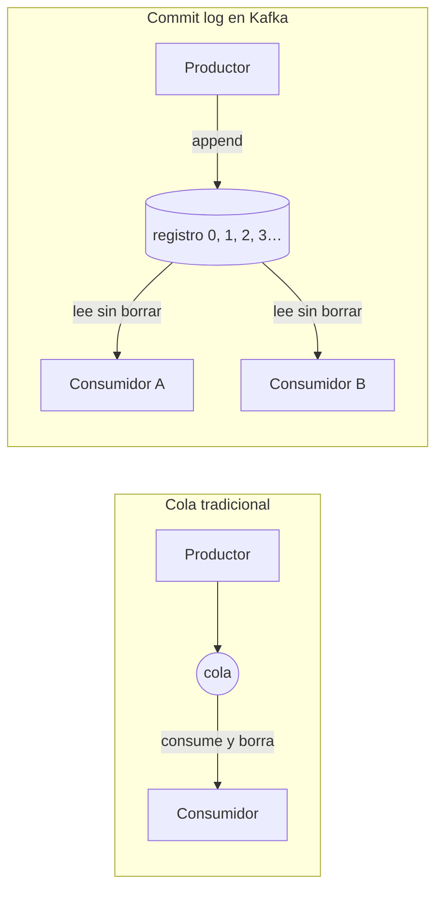

En el post anterior, [¿Por qué se llama Kafka? Y qué hace, en realidad](/blog/que-es-kafka-y-por-que-se-llama-asi), vimos qué es Kafka a grandes rasgos: un sistema para que tus aplicaciones se comuniquen de forma asíncrona —unos publican eventos, otros los leen cuando puedan—. Hoy toca deshacernos del malentendido que casi todos traemos de fábrica.

Porque resulta que Kafka **no es una cola**. Se parece, se usa como si lo fuera y hasta las comparaciones de la documentación invitan a pensarlo así. Pero por dentro es otra cosa: un **registro**. Y esa diferencia, que suena a puro pedantería de arquitecto, es la que explica por qué Kafka resuelve problemas donde una cola tradicional se queda corta.

## El modelo mental que hay que tirar a la basura

Cuando piensas "cola de mensajes" imaginas la fila del súper: cada quien llega, lo atienden, se va, y la fila sigue su vida. En versión técnica: un productor empuja mensajes, un consumidor los saca, y **en cuanto el mensaje se entrega, desaparece de la cola**. Punto.

Ese modelo funciona bien para un montón de casos: mandar un correo de bienvenida, repartir un trabajo pesado entre varios workers, desacoplar dos servicios que no quieren hablarse en tiempo real. No es un mal modelo; es simplemente un modelo con memoria de pez.

Y ahí está el detalle: **una vez que el mensaje se fue, se fue**. Si el consumidor lo procesó a la mitad y tronó —un crash, un bug, se fue la luz— no hay vuelta atrás: el mensaje ya no existe y nadie lo va a volver a entregar. Y si a media noche llega otro equipo y dice "oye, yo también quiero esos eventos", pues ya se los comió el primero que pasó.

¿Y si en lugar de borrar los mensajes al entregarlos, los dejáramos escritos?

## La idea central: Kafka es un commit log

Aquí está la frase que quieres llevarte a casa: **Kafka es un commit log distribuido**. Un *commit log* —o simplemente *log*, registro— es una estructura de datos de las de toda la vida: una lista a la que **solo le puedes agregar registros al final**, en orden, y que vive escrita en disco. Es el mismo concepto que llevan décadas usando las bases de datos para su bitácora de transacciones; la novedad es que Kafka lo puso en el centro de la mensajería.

Tres propiedades, una por una:

- **Append-only (solo se agrega al final)**: los registros entran en el orden en que llegan y nadie los modifica ni los reordena. No hay updates, no hay deletes. Escribes al final, y ya.
- **Persistente**: los registros viven en disco, no en la memoria de nadie. Si un servidor se reinicia, si se va la luz, si el proceso muere, los registros siguen ahí, esperando a que alguien los lea.
- **Replicado**: cada registro existe en más de una máquina. Si una muere, los datos sobreviven en las otras. (Cómo logra esto se ve a detalle en el siguiente post.)

Visualizado, un log se ve así:

```
 topic: pedidos

   [offset 0]  "cliente A pidió 3 tacos"
   [offset 1]  "cliente B pidió 1 café"
   [offset 2]  "cliente A pidió 2 quesadillas"
   [offset 3]  "cliente C pidió 1 burrito"
                                      ↑
        el siguiente registro entra aquí, con offset 4 — solo al final
```

Cada renglón es un **registro** (record) y su número de renglón es su **offset**. Piénsalo como la bitácora del capitán: las entradas van numeradas, nadie arranca hojas, y cualquiera puede regresar a la entrada de hace dos semanas y releerla. (Una aclaración de honestidad técnica: el offset vive dentro de una *partition*, y por ahora basta imaginar un solo cuaderno; las partitions vienen en el siguiente post.)

Ojo con un detalle, para no vender humo: Kafka **no** guarda todo para siempre. Tiene una política de retención —por defecto borra lo viejo tras cierto tiempo o cierto tamaño— y tú la configuras: horas, días, o "no borres nunca". El punto no es la eternidad. El punto es que **los registros no desaparecen porque alguien los haya leído**. Esa es toda la diferencia con la cola.

## Cola vs. registro: la diferencia que lo cambia todo

En una cola tradicional, consumir es destructivo: entregar y borrar. En Kafka, leer es solo leer: escribir al final, releer cuantas veces quieras. Los dos flujos, lado a lado:



Con esto ya puedes ponerle nombre formal al vocabulario que veníamos manejando suelto:

- **Topic**: el nombre del canal —el cuaderno— donde viven los registros. Los productores escriben ahí y los consumidores leen de ahí.
- **Offset**: la posición numérica de cada registro dentro del topic. Cero, uno, dos, tres… siempre creciente, siempre en orden.
- **Persistencia**: el hecho de que los registros viven en disco y replicados en varios servidores, no flotando en la RAM de un solo proceso.
- **Replay**: poder releer. Como cada consumidor lleva su propia marca de "por dónde voy", puede regresar esa marca y volver a leer lo que quiera.

Fíjate en la jugada: en una cola normal, "ya lo leí" se traduce en "ya no existe". En Kafka, "ya lo leí" es apenas una nota adhesiva que dice *"voy por el offset 42"* — y esa nota **la lleva cada consumidor por su cuenta**. El registro sigue intacto en el cuaderno, disponible para quien quiera leerlo de nuevo.

## El replay es un superpoder

Esto de poder releer no es un detalle bonito de manual: cambia cómo resuelves problemas. Tres ejemplos concretos:

**Bug en el consumidor.** Tu servicio de facturación lleva tres días tragando eventos del topic de pagos, y descubres que calculaba mal los impuestos. Con una cola: los eventos ya se fueron; a hacer una migración a mano y cartas de disculpa. Con Kafka: corriges el bug, mueves el offset de tu consumidor tres días atrás y dejas que reprocese. Los datos nunca faltaron; estaban esperándote en el log.

**Llegar tarde a la fiesta.** Se te ocurre una aplicación nueva —métricas, detección de fraude, lo que sea— que necesita los mismos eventos que ya se están publicando. Con una cola tendrías que montar otro flujo desde cero, o pelearle los mensajes al consumidor existente. Con Kafka: conectas un consumidor nuevo al topic y le dices "empieza desde el offset 0". O desde ayer. O desde hace una hora. El historial completo está ahí.

**Muchos lectores, un solo canal.** Un mismo flujo de eventos puede alimentar a tres equipos a la vez: notificaciones, analítica y auditoría leen del mismo topic, cada uno a su propio ritmo y con su propio offset. Nadie le quita mensajes a nadie; nadie depende de que el otro sea rápido.

Eso de "los mismos datos, muchas lecturas independientes" es algo que una cola simple no te da de fábrica. Y es la razón por la que la gente de datos, cuando prueba Kafka, no quiere regresar a la fila del súper.

## Coda

Hasta aquí la parte conceptual: ya sabes que Kafka es un registro append-only, persistente y replicado; ya sabes qué son el topic, el offset y el replay; y ya sospechas por qué el replay se siente como hacer trampa… del lado bueno.

Pero todo esto de cuadernos, renglones y bitácoras suena muy bonito en el papel. Para que todo esto funcione hace falta una máquina —de hecho, varias—. En el siguiente post abrimos la caja y vemos qué hay adentro: brokers, partitions y réplicas. La cita es aquí: [Kafka por dentro](/blog/kafka-por-dentro-arquitectura).

¡Saludos! 👋
