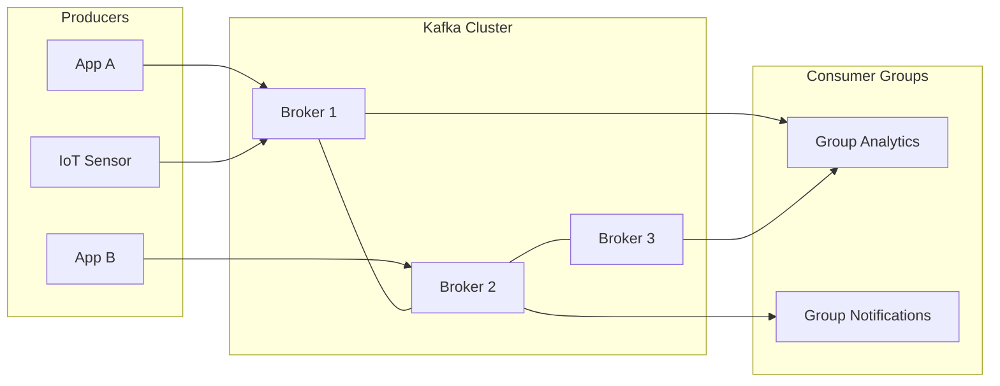
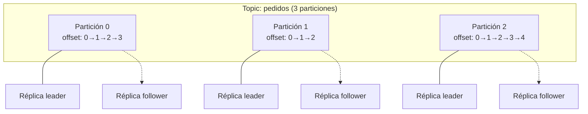
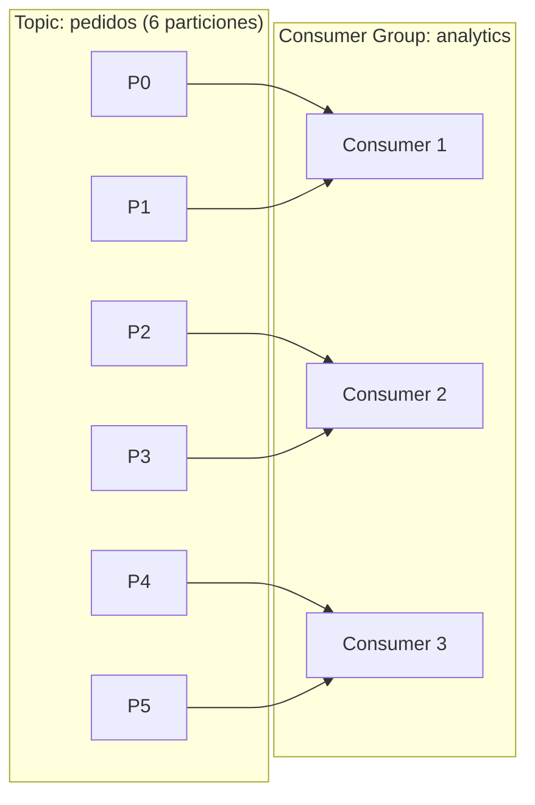

En el [post anterior](/blog/kafka-no-es-una-cola-es-un-registro/) dijimos que Kafka no es una cola: es un **commit log**. Un archivo append-only donde cada mensaje lleva un offset, y los consumidores no reciben eventos — los leen, a su ritmo, desde donde se quedaron. Esa idea es la clave de todo lo que viene.

Pero un log en un archivo de texto no escala. Si tu empresa produce un millón de eventos por segundo, necesitas repartir ese log en múltiples máquinas, replicarlo para que no se pierda nada, y permitir que docenas de consumidores lo lean en paralelo sin estorbarse. Eso es exactamente lo que Kafka resuelve con su arquitectura.

Vamos a abrir la caja.

## De menos a más: los componentes

### Producers: quiénes escriben

Un **producer** es cualquier sistema que envía mensajes a Kafka. Puede ser una aplicación Java, un microservicio en Go, un agente de colecta de logs, un IoT sensor — da igual. El producer no necesita saber quién va a leer, ni cuántos consumers existen, ni dónde está el broker. Solo sabe dos cosas: el **topic** al que escribe y el **broker** al que le manda el mensaje.

Conecta con la idea de [desacoplamiento del Post A](/blog/que-es-kafka-y-por-que-se-llama-asi/): el producer no tiene dependencia temporal ni espacial con el consumer. Puede estar escribiendo mientras el consumer está dormido, o el consumer puede leer eventos de hace tres meses.

### Brokers: la máquina que guarda el log

Un **broker** es una instancia de Kafka — básicamente un servidor que acepta conexiones de producers y consumers, y almacena los mensajes en disco. Un broker individual ya es útil: recibe mensajes, los escribe en su log, y se los sirve a quien pregunte.

Pero en producción nunca tienes un solo broker. Tienes un **cluster**: un grupo de brokers que se conocen entre sí y coordinan. El cluster es la unidad de despliegue de Kafka. Cuando alguien dice "levanté un cluster de Kafka con 3 brokers", se refiere a tres instancias de Kafka corriendo en tres máquinas (o contenedores) que forman un solo sistema lógico.

### Topics y particiones: cómo se reparte el log

Aquí es donde la cosa se pone interesante.

Un **topic** es un nombre lógico — piensa en él como una " categoría" o "canal". Los producers escriben a un topic específico (`pedidos`, `clicks`, `logs-aplicacion`), y los consumers se suscriben a los topics que les importan.

Pero un topic no es un solo archivo gigante. Kafka lo divide en **particiones**. Cada partición es un log independiente, con sus propios offsets secuenciales. Si un topic tiene 3 particiones, Kafka reparte los mensajes entre esas tres particiones (generalmente de forma round-robin, a menos que uses un key específico).

¿Por qué importa? Porque las particiones son la unidad de **paralelismo**. Si tienes un topic con una sola partición, solo un consumer puede leerlo a la vez de forma efectiva (más sobre esto en un momento). Con 6 particiones, puedes tener hasta 6 consumers leyendo en paralelo, cada uno encargado de su partición.

¿Ves la conexión con el [Post B](/blog/kafka-no-es-una-cola-es-un-registro/)? Cada partición es exactamente ese commit log que describimos: un offset, un mensaje, otro offset, otro mensaje. La diferencia es que ahora el log está **fraccionado** en pedazos manejables que pueden vivir en máquinas distintas.

### Réplicas: tolerancia a fallos

Cada partición tiene una **réplica leader** y varias **réplicas followers**. La leader es la que recibe escrituras del producer y sirve lecturas del consumer. Los followers no hacen nada activamente — solo replican los datos de la leader. Si la leader se cae, una de las followers toma su lugar.

Esto es la **replicación**. El parámetro `replication.factor` define cuántas copias de cada partición existen. Si `replication.factor = 3`, hay una leader y dos followers. Si se mueren dos máquinas al mismo tiempo, pierdes datos — pero una sola falla no te toca.

Kafka también define un `min.insync.replicas`: el número mínimo de réplicas que deben confirmar una escritura antes de que el producer la considere exitosa. Si tienes `replication.factor = 3` y `min.insync.replicas = 2`, una escritura se confirma solo cuando al menos 2 réplicas la tienen. Esto te da un balance entre durabilidad y disponibilidad.

### Consumer groups: cómo varios leen el mismo log

Un **consumer** es una aplicación que lee mensajes de un topic. Pero Kafka no manda un mensaje a cada consumer individualmente — lo manda a un **consumer group**.

Un consumer group es un conjunto de instancias de consumer que trabajan juntas. Kafka reparte las particiones del topic entre los consumers del grupo. Si el topic tiene 6 particiones y el grupo tiene 3 consumers, cada consumer se encarga de 2 particiones. Si agregas un cuarto consumer, Kafka reasigna: tres consumers leen 2 particiones y uno lee 0 (o Kafka se reequilibra para repartir mejor).

¿Por qué importa? Porque esto es lo que hace que Kafka **escale horizontalmente**. No necesitas un consumer super-potente que lea todo el topic. Puedes tener 20 consumers pequeños repartidos entre las particiones, y Kafka coordina quién lee qué.

Y aquí vuelve el concepto de **replay** del Post B. Si tu consumer se cae y vuelve a arrancar, Kafka le recuerda desde qué offset estaba leyendo (guardado en un topic interno llamado `__consumer_offsets`). Puede releer desde ahí, o saltar al final, o incluso volver a empezar desde el offset 0 si necesita reprocesar todo. El log no desaparece — los offsets persisten.

## El panorama completo

En resumen, la arquitectura de Kafka se reduce a esto:

1. **Producers** escriben mensajes a un **topic**.
2. El topic se divide en **particiones**, cada una un log ordenado con offsets.
3. Las particiones se **replican** entre brokers para resistir fallos.
4. **Consumer groups** reparten las particiones entre múltiples consumers para leer en paralelo.
5. Los **offsets** permiten replay, pausa y resumición de lectura.

Es un sistema diseñado para una cosa: mover datos de A a B a escala, con garantías de orden y durabilidad, sin acoplar al productor con el consumidor.

Y como dijimos al inicio: todo parte de un commit log. Solo que ahora ese log vive en un cluster de brokers, está fraccionado en particiones, replicado por si las moscas, y leído por groups de consumers que pueden replayear todo lo que quieran.

**FIN**
